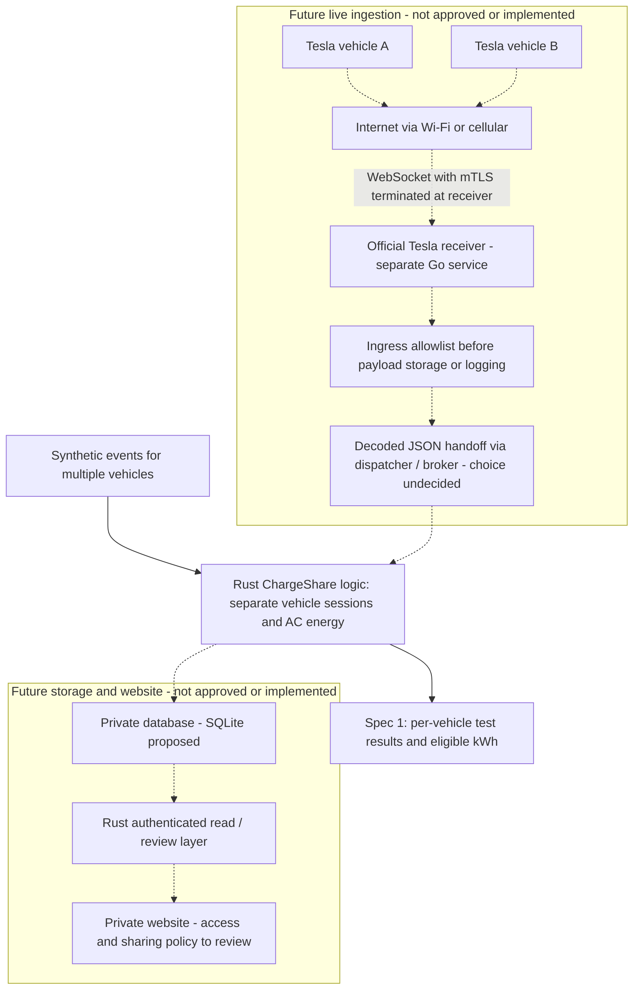

# Architecture and domain contract

ChargeShare currently implements an in-memory, synthetic multi-vehicle Rust
ledger in [chargeshare-core](../crates/chargeshare-core/src/lib.rs). Spec 1 was
approved and implemented on 2026-10-02. There is no executable application,
live receiver, account integration, database, UI or runtime dependency.
Owner/vehicle scope checks are domain invariants, not authentication or approved
cross-owner sharing. Nothing calculates money owed or certifies a meter.

The [archived OpenSpec change](../openspec/changes/archive/2026-10-03-offline-multi-vehicle-ledger/proposal.md)
retains its original review context. The accepted requirements are now in the
[main vehicle-ledger spec](../openspec/specs/vehicle-ledger/spec.md). The contract
below describes implemented behavior; later integrations require separately reviewed specs and explicit approval.

## Architecture at a glance

The solid path is the **implemented offline Spec 1 exercise**. All other
components remain proposed and unimplemented; dashed paths are future integrations requiring
separately reviewed specs and explicit approval.

The Go receiver is a separate process, not Go code embedded in Rust. Its proposed
handoff to Rust is decoded JSON through a supported dispatcher/broker, not a
stock Tesla HTTP webhook. Tesla documents decoded dispatcher output and options
such as Kafka; the broker and durability approach remain undecided. This
background comes from Tesla's Fleet Telemetry receiver configuration guidance;
it does not select or authorize an integration.

The allowlist box is a required ingress policy, not an implemented extra service.
A future integration must enforce it before any receiver sink, payload log or
broker persistence. Spec 1 bypasses all live transport, database and website
components: it exercises Rust domain behavior using fictional inputs only.
Neither a cloud nor home host is selected; a future receiver needs suitable
public reachability and security. The website must use authenticated application
access, never direct public database access; owner visibility remains a review
question rather than approved cross-owner sharing.

## Implemented offline ledger

All public examples and tests are fictional. Callers must keep real vehicle data
out of this milestone.

### Core module ownership

The user-approved 2026-10-02 refactor preserves Spec 1 behavior and the existing
crate-root public API. [The facade](../crates/chargeshare-core/src/lib.rs) declares
private modules and explicitly re-exports the public domain types:

- [energy](../crates/chargeshare-core/src/energy.rs): exact kWh parsing, formatting,
  checked addition and crate-private checked counter deltas
- [identity](../crates/chargeshare-core/src/identity.rs): validated synthetic
  owner, vehicle and connection aliases, plus compound session identity
- [event](../crates/chargeshare-core/src/event.rs): typed synthetic evidence and
  rejected-counter reasons without raw input retention
- [session](../crates/chargeshare-core/src/session.rs): quality and exclusion
  policy, charger classification, evidence label and pure connection replay
- [ledger](../crates/chargeshare-core/src/ledger.rs): in-memory vehicle partitioning,
  registration, deduplication, scoped reads/reviews and checked summaries
- [error](../crates/chargeshare-core/src/error.rs): safe ledger failures and
  diagnostics that never echo rejected values

Energy and error depend only on the standard library. Identity depends on error;
event on identity and energy; session on identity, event, energy and error;
ledger on these domain modules. No implementation imports through the public
facade, and no domain module depends on an adapter or external service.

The smallest viable split replaces the single implementation file with cohesive
private modules. Keeping one file would avoid movement but leave unrelated
responsibilities coupled; an application crate, replay submodule, traits or
adapter interfaces would add boundaries without an approved consumer. They remain
deferred with persistence, live ingestion, authentication, pricing and UI.

Ledger replay groups already vehicle-partitioned evidence by connection, marks
conflicts explicitly with a named internal evidence type, and stably sorts by
`(time, position)` before pure reconstruction. Session replay preserves every
conflict barrier and quality reason. Counter subtraction stays inside `Energy`;
a negative delta is a rollback, never wrapping arithmetic. No representation,
public signature, event ordering, data format or runtime dependency changes.

The unchanged [17 public acceptance scenarios](testing.md#spec-1-scenario-coverage)
prove scoped isolation, deterministic replay, conservative energy and failure
behavior. Focused arithmetic tests additionally cover the internal delta at zero,
equal counters, the maximum representable value and rollback.

### Accepted input

Construct `OwnerId`, `VehicleId` and `ConnectionId` from synthetic aliases of
1–64 ASCII letters, digits, underscores or hyphens. A vehicle has exactly one
owner; registering an alias twice is rejected, even with the same owner. Alias
and identity errors never echo rejected values. An event requires a configured
vehicle and an explicit connection alias. Positions are unique within each
vehicle, across all its connections. Time is a synthetic signed integer tick.
There is no wall-clock, automatic closing timeout or Tesla payload parser.

Energy accepts unsigned ASCII decimal kWh with up to six fractional digits
(one milliwatt-hour per internal unit). Whole digits are required. No sign,
whitespace, exponent, NaN, infinity or excess precision is accepted. The maximum
is 18,446,744,073,709.551615 kWh. Parsing and addition fail explicitly on overflow;
no floating-point addition or silent rounding occurs. `CounterReading::parse_kwh`
stores either exact energy or a safe rejected-counter reason, never the raw text.

### Replay and evidence

`Ledger::ingest` partitions evidence by vehicle before deduplication. Identical
repeats at one position are no-ops. Distinct payloads at the same vehicle position
are retained as conflicts: every connection mentioned there is held, and none of
the conflicting payloads is selected as a measurement or boundary. Each candidate
creates an uncertainty barrier at its time/position, breaking the counter chain
and retaining DC/ambiguous/rejected-counter reasons. Replay orders
uncontested events by `(time, position)` within each connection. Session identity
is the pair `(vehicle, connection)`, so late evidence cannot move a review to a
different session. Connection aliases must not be reused for another connection.

Synthetic `Start` and `End` events are explicit boundaries. A valid counter on
those events is the baseline/terminal sample. `Pause` and `Resume` stay in the
same connection. AC markers without a sample keep the cumulative counter chain;
invalid counter or non-AC evidence breaks it. Deltas never cross a connection.
A rollback counts no negative delta, retains valid positive observed deltas and
holds the entire session. Missing baseline, terminal sample or boundary, rejected
counters, conflicts and malformed boundary ordering remain visible quality flags.
Silence does not supply a boundary, a sample or zero consumption. Observed deltas
are incomplete evidence when any flags remain, not an invented complete total.

Any DC or ambiguous charge-type evidence excludes the session from shared-charger
eligibility. Only complete, uncontested AC sessions explicitly classified
`SharedCharger` are eligible. All sessions default to `Unconfirmed`; `OtherCharger`
is also excluded. Classification never clears quality flags. `sessions`,
`summary` and `classify` require an explicit configured vehicle scope; a target
for another vehicle is rejected without mutation. There is no combined-owner
query. Each summary includes scoped owner/vehicle, observed and eligible energy,
held/excluded reasons. Every session and summary carries an explicit synthetic,
physically unvalidated evidence label.

### Real-telemetry gap

These counter, boundary and charge-type semantics are a fixture contract. They
are not claims about Tesla's production counter resets, samples or session state.
The actual Go receiver, adapter, durable ingestion and manual real-car validation
remain separate approved future specs. No location, credentials, account IDs,
vehicle controls, tariffs, statements or payments are implemented.

## Measurement boundary

Physical accuracy is unvalidated. Tesla describes `ACChargingEnergyIn` as
charger-measured AC-session energy; battery-side `charge_energy_added` measures a
different boundary. Neither signal establishes utility-certified accuracy.
Validate the actual vehicle/firmware, units, resets, latency and final samples
before using real telemetry for an agreed reimbursement estimate.

Do not add a generic charging-loss multiplier. Upstream wiring, charger standby,
plugged-in auxiliary consumption and billing-meter boundaries may differ. A
permitted independent AC-energy reference is needed to quantify a systematic
difference. Without one, retain the unvalidated label and agree that limitation
before reimbursement. A parser or simulated receiver test cannot establish
physical accuracy. See the [manual validation gate](testing.md#manual-real-car-validation-gate).

## Future integrations

Everything in this section is proposed, unimplemented and outside Spec 1.
It records requirements for later review, not permission to build or connect them.

### Data flow and trust boundaries

1. Each separately approved vehicle sends Fleet Telemetry to Tesla's official
   receiver over its supported authenticated transport.
2. Enforce the vehicle ingress allowlist before any raw-payload persistence,
   receiver sink, payload log or broker storage. Reject unknown vehicles without
   retention. Persist accepted evidence on encrypted private storage; a Rust
   adapter normalizes it and records event time and receipt time separately.
3. SQLite is a proposed private store for evidence references, derived sessions,
   versioned tariffs and review decisions. Replay must be deterministic,
   transactional and recoverable after a crash; retain durable processor offsets.
4. An authenticated private view and CSV exporter would show aliases, quality
   flags, manual shared-charger labels and reproducible monthly estimates.
   Owner visibility and cross-owner sharing need their own reviewed policy.

One always-on host with persistent storage may suffice. Keep mTLS/WebSocket
termination at the official Go receiver; a generic TLS-terminating reverse proxy
must not remove authentication guarantees. A static website cannot receive this
stream. The only proposed public surfaces are the required listener and public-key
discovery path. Never expose the database, raw files, command proxy or debug endpoints.
Neither cloud nor home hosting, nor a dispatcher/broker, has been selected.

### Language and records

Implement future ChargeShare adapters, session reconstruction, pricing, private
view and CSV in Rust. Keep the official Go receiver as a separate external
service; do not rewrite its protocol. Node.js/npm is development tooling only.
SQLite, persistence and the private view are not current dependencies.

Proposed records:

- Raw event: private vehicle identity, source/receipt timestamps, field/value/unit,
  invalid status, payload hash, original evidence reference and schema version
- Counter segment: valid baseline/end sample, nonnegative deltas, timestamp
  interval and reset/gap reason
- Session: internal ID, connection/charge evidence, AC/DC state, segments,
  boundary uncertainty, quality flags, charger label and review notes
- Tariff version: currency, IANA timezone, effective dates, rate windows,
  calendar/holiday rules and agreed variable charges
- Statement revision: month, session/tariff versions, energy/cost breakdown,
  quality decisions, rounding policy and generation time

Real VINs and raw payloads remain private runtime data, never fixtures. UI/CSV
should use aliases by default. Public repository data rules are in [SECURITY.md](../SECURITY.md).

### Energy, reliability and pricing

Use cumulative `ACChargingEnergyIn` deltas only within a validated segment.
`ACChargingPower`, `DetailedChargeState` and `ChargingCableType` may explain
activity and eligibility. Validate actual changed-value behavior and reporting
intervals; absence of messages proves neither zero consumption nor a session end.
Reconnects, pauses, restarts, duplicates and late events must not double-count.
Unresolved rollbacks block finalization. Never fill a long gap with the last
power reading or state of charge. Vehicle buffering is finite; extended outages
can lose evidence, so collection health, receipt and durability gaps must be visible.

Split pricing intervals at tariff boundaries, midnight, month-end and effective
dates using the configured IANA timezone. Store UTC instants and handle repeated
or skipped local hours unambiguously. Use decimal arithmetic and an agreed
currency rounding policy. Fixed/demand charges, tiers and solar/net-metering
require separate allocation decisions.

A short, explicitly bounded interpolation is estimated. A long cross-rate gap
holds the session or shows a range. A cumulative endpoint may restore energy
without restoring timing; never apply the start-time rate to an overnight session.
Version tariffs and review decisions so exported totals stay reproducible.
Corrections create a new statement revision. Statements are review aids, not
automatic invoicing, payment authorization or legal determinations.

### Live preflight and deferred alternatives

Before any separately approved live trial, verify:

- Actual firmware/signal support, counter/reset and session semantics
- Regional app registration, authorized host/domain, exact callbacks, public-key
  discovery and virtual-key pairing requirements
- Minimal telemetry-configuration permissions, OAuth state validation, atomic
  refresh-token rotation and private server-side secret storage
- Receiver transport, persistent storage, authenticated access and explicit
  stop/revoke, recovery and rollback procedures
- Agreed tariff/currency/timezone, measurement uncertainty, hosting/domain/API
  budget, payment setup and collection-health/billing-cap alerts

Do not use routine Fleet API polling or wake a car to collect reimbursement data.
Do not assume charging-history APIs cover private-home AC charging. Automatic
GPS geofencing adds sensitive collection; manual shared-charger confirmation is
preferred before any location feature. Charger-side metering may offer a useful
independent reference later with permission. Extra services and multi-tenant
storage remain deferred. Vehicle controls and payment execution are outside scope.

### Background attribution

Earlier research checked Tesla's official documentation on 2026-10-02:
Fleet Telemetry available data, setup/system behavior and receiver configuration;
Fleet API FAQ/staging limits, authentication scopes, authorization/refresh tokens,
virtual keys, onboarding, billing/limits, best practices and charging-history
limitations. These names preserve provenance without external navigation.
Historical prices, firmware cutoffs and proposed sampling settings are not
current requirements; reverify them in a separately approved integration spec.
