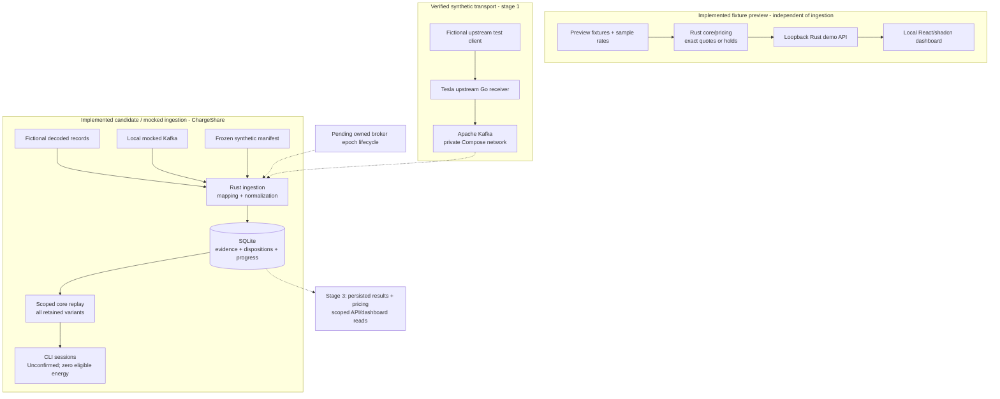

# Architecture and domain contract

ChargeShare implements a pure synthetic Rust ledger/pricing core, an independent
localhost fixture preview, and the approved [stage-2 ingestion crate](durable-ingestion.md).
Ingestion retains curated fictional evidence and recovery progress in local SQLite
and rebuilds scoped, unconfirmed sessions. Its candidate/direct/mocked tests pass;
the actual receiver-to-Kafka-to-SQLite path has not run. No live Tesla account,
production authentication or deployment is connected. Domain owner/vehicle checks
are not authentication or permission for cross-owner sharing.

The separate [stage-1 harness](local-development.md) now verifies synthetic
authenticated traffic through the official receiver into Kafka on Linux x86_64.
Its [acceptance evidence](testing.md#complete-linux-acceptance-and-warm-caches)
covers transport, retained replay, stop/start, reset and cleanup. That traffic
does not enter the ledger, database or dashboard.

The canonical [ledger](../openspec/specs/vehicle-ledger/spec.md),
[pricing](../openspec/specs/session-pricing/spec.md) and
[dashboard](../openspec/specs/local-dashboard/spec.md) contracts remain unchanged.
The active [ingestion design](../openspec/changes/durable-synthetic-ingestion/design.md)
and [tasks](../openspec/changes/durable-synthetic-ingestion/tasks.md) retain its
unfinished integration acceptance. The roadmap is in [the POC plan](plan.md).

## Architecture at a glance

Solid arrows show implemented flows exercised by synthetic fixtures, local mock
Kafka or the verified stage-1 receiver/Kafka harness. Dashed arrows show pending
integration; they do not indicate running services.
The fixture preview and retained-ingestion view use separate in-memory ledgers.

Tesla owns the external receiver software, Apache owns Kafka and SQLite is an
upstream embedded database. ChargeShare owns their local configuration, the Rust
adapter/schema/transactions and domain rules. SQLite is a file, not a separate
server. Existing CLI replay does not populate the fixture dashboard; persisted
results and reviews remain a separately reviewed stage-3 change.

## Durable ingestion and recovery boundary

The outer [ingestion facade](../crates/chargeshare-ingestion/src/lib.rs) keeps IO and
receiver-shaped payloads outside the dependency-free core:

- `manifest`/`normalize`: frozen fictional associations and exact observed counters;
  explicit boundary annotations never create an event without an observed record
- `kafka`/`stream`: manual partition assignment, epoch/identity/retention checks;
  automatic broker commits and offset storage are disabled
- `store`/`schema`: one owning writer, versioned SQLite, curated accepted variants
  or fixed rejection reasons, provenance and progress in one WAL/FULL transaction
- `replay`: all scoped retained variants enter the unchanged core; conflict holds,
  exact energy and Unconfirmed classification are preserved
- `main`: bounded consume, scoped replay and the explicitly labeled candidate demo

SQLite is the sole recovery-position authority. A known rollback changes neither
evidence nor progress; interrupted commits recover consistent old-or-new state.
Redelivery is idempotent, while distinct domain variants are retained. No arbitrary
raw JSON, rejected text, names or locations are stored. Private ignored runtime
files and the [documented filesystem/deadline limits](durable-ingestion.md) bound
these guarantees; they do not establish backup or cloud durability.

## Pending all-services integration

[PR #5](https://github.com/jestrada/ChargeShare/pull/5) publishes the verified stage-1
harness at `33a4568`. Its Linux receiver/Kafka acceptance passes after an observed
deliberate assertion failure and cleanup; deliberate-failure mode is removed.
[The recorded evidence](testing.md#complete-linux-acceptance-and-warm-caches)
covers transport, retained replay, stop/start, reset and cleanup.

Stage-2 runtime integration still needs the owned broker epoch marker, preserving
it on restart and replacing it on explicit reset. The reviewed Kafka endpoint
is `kafka:9092`
inside its private Compose network, with no host listener. An in-network ingestion
runner and receiver → Kafka → SQLite → scoped replay acceptance are still pending.
[Stage 3](plan.md#stage-3-run-the-persisted-synthetic-poc-end-to-end) adds the all-services
startup/readiness and persisted priced API/dashboard path; it does not make these
parent or ingestion gates complete by moving them to another PR.

Live vehicle transport, ingress allowlisting before sinks/logs/persistence,
production authentication and cross-owner sharing need separately approved
contracts. Cloudflare/Terraform deployment is stage 4. Neither the local synthetic
tests nor exact arithmetic certify utility-meter accuracy or a real bill.

## Implemented offline ledger

Vehicle examples and tests are synthetic; the preview also has a public sample
rate table. Callers must keep real vehicle data
out of this milestone.

### Core module ownership

The user-approved 2026-10-02 refactor preserves Spec 1 behavior and the existing
crate-root public API. [The facade](../crates/chargeshare-core/src/lib.rs) declares
private modules and explicitly re-exports the public domain types:

- [energy](../crates/chargeshare-core/src/energy.rs): exact kWh parsing, formatting,
  checked addition and crate-private checked counter deltas
- [identity](../crates/chargeshare-core/src/identity.rs): validated synthetic
  owner, vehicle and connection aliases, plus compound session identity
- [event](../crates/chargeshare-core/src/event.rs): typed synthetic evidence and
  rejected-counter reasons without raw input retention
- [session](../crates/chargeshare-core/src/session.rs): quality and exclusion
  policy, charger classification, evidence label and pure connection replay
- [ledger](../crates/chargeshare-core/src/ledger.rs): in-memory vehicle partitioning,
  registration, deduplication, scoped reads/reviews and checked summaries
- [error](../crates/chargeshare-core/src/error.rs): safe ledger failures and
  diagnostics that never echo rejected values

Energy and error depend only on the standard library. Identity depends on error;
event on identity and energy; session on identity, event, energy and error;
ledger on these domain modules. No implementation imports through the public
facade, and no domain module depends on an adapter or external service.

The refactor replaced the single implementation file with cohesive private
modules. Extra core application layers, replay submodules, traits and generic
adapter interfaces remain unnecessary. Approved ingestion and preview IO now
live in their outer crates without changing that core boundary.

Ledger replay groups already vehicle-partitioned evidence by connection, marks
conflicts explicitly with a named internal evidence type, and stably sorts by
`(time, position)` before pure reconstruction. Session replay preserves every
conflict barrier and quality reason. Counter subtraction stays inside `Energy`;
a negative delta is a rollback, never wrapping arithmetic. No representation,
public signature, event ordering, data format or runtime dependency changes.

The unchanged [17 public acceptance scenarios](testing.md#spec-1-scenario-coverage)
prove scoped isolation, deterministic replay, conservative energy and failure
behavior. Focused arithmetic tests additionally cover the internal delta at zero,
equal counters, the maximum representable value and rollback.

### Accepted input

Construct `OwnerId`, `VehicleId` and `ConnectionId` from synthetic aliases of
1–64 ASCII letters, digits, underscores or hyphens. A vehicle has exactly one
owner; registering an alias twice is rejected, even with the same owner. Alias
and identity errors never echo rejected values. An event requires a configured
vehicle and an explicit connection alias. Positions are unique within each
vehicle, across all its connections. Time is a synthetic signed integer tick.
There is no wall-clock, automatic closing timeout or Tesla payload parser.

Energy accepts unsigned ASCII decimal kWh with up to six fractional digits
(one milliwatt-hour per internal unit). Whole digits are required. No sign,
whitespace, exponent, NaN, infinity or excess precision is accepted. The maximum
is 18,446,744,073,709.551615 kWh. Parsing and addition fail explicitly on overflow;
no floating-point addition or silent rounding occurs. `CounterReading::parse_kwh`
stores either exact energy or a safe rejected-counter reason, never the raw text.

### Replay and evidence

`Ledger::ingest` partitions evidence by vehicle before deduplication. Identical
repeats at one position are no-ops. Distinct payloads at the same vehicle position
are retained as conflicts: every connection mentioned there is held, and none of
the conflicting payloads is selected as a measurement or boundary. Each candidate
creates an uncertainty barrier at its time/position, breaking the counter chain
and retaining DC/ambiguous/rejected-counter reasons. Replay orders
uncontested events by `(time, position)` within each connection. Session identity
is the pair `(vehicle, connection)`, so late evidence cannot move a review to a
different session. Connection aliases must not be reused for another connection.

Synthetic `Start` and `End` events are explicit boundaries. A valid counter on
those events is the baseline/terminal sample. `Pause` and `Resume` stay in the
same connection. AC markers without a sample keep the cumulative counter chain;
invalid counter or non-AC evidence breaks it. Deltas never cross a connection.
A rollback counts no negative delta, retains valid positive observed deltas and
holds the entire session. Missing baseline, terminal sample or boundary, rejected
counters, conflicts and malformed boundary ordering remain visible quality flags.
Silence does not supply a boundary, a sample or zero consumption. Observed deltas
are incomplete evidence when any flags remain, not an invented complete total.

Any DC or ambiguous charge-type evidence excludes the session from shared-charger
eligibility. Only complete, uncontested AC sessions explicitly classified
`SharedCharger` are eligible. All sessions default to `Unconfirmed`; `OtherCharger`
is also excluded. Classification never clears quality flags. `sessions`,
`summary` and `classify` require an explicit configured vehicle scope; a target
for another vehicle is rejected without mutation. There is no combined-owner
query. Each summary includes scoped owner/vehicle, observed and eligible energy,
held/excluded reasons. Every session and summary carries an explicit synthetic,
physically unvalidated evidence label.

### Real-telemetry gap

These counter, boundary and charge-type semantics are a fixture contract. They
are not claims about Tesla's production counter resets, samples or session state.
The synthetic Go receiver-to-Kafka transport is verified. The synthetic adapter
and durable retention are implemented; receiver-backed ingestion acceptance and
manual real-car validation remain pending. Real-data mapping, trust/retention,
tariff calendars and production access require separate approved contracts. No
live location/account data, vehicle controls, real statements or payments are connected.

## Measurement boundary

Physical accuracy is unvalidated. Tesla describes `ACChargingEnergyIn` as
charger-measured AC-session energy; battery-side `charge_energy_added` measures a
different boundary. Neither signal establishes utility-certified accuracy.
Validate the actual vehicle/firmware, units, resets, latency and final samples
before using real telemetry for an agreed reimbursement estimate.

Do not add a generic charging-loss multiplier. Upstream wiring, charger standby,
plugged-in auxiliary consumption and billing-meter boundaries may differ. A
permitted independent AC-energy reference is needed to quantify a systematic
difference. Without one, retain the unvalidated label and agree that limitation
before reimbursement. A parser or simulated receiver test cannot establish
physical accuracy. See the [manual validation gate](testing.md#manual-real-car-validation-gate).

## Future integrations

The original Spec 1 integration discussion below remains future work. Offline
session pricing is now implemented separately: `money` depends on `energy`,
`tariff` on `money`, and `pricing` on these types and reconstructed session
evidence. Ledger orchestrates the additive scoped query. The core still has no
runtime dependencies. Real tariff calendars and invoices are not implemented.

Everything in this section is proposed, unimplemented and outside Spec 1.
It records requirements for later review, not permission to build or connect them.

### Data flow and trust boundaries

1. Each separately approved vehicle sends Fleet Telemetry to Tesla's official
   receiver over its supported authenticated transport.
2. Enforce the vehicle ingress allowlist before any raw-payload persistence,
   receiver sink, payload log or broker storage. Reject unknown vehicles without
   retention. Persist accepted evidence on encrypted private storage; a Rust
   adapter normalizes it and records event time and receipt time separately.
3. SQLite is a proposed private store for evidence references, derived sessions,
   versioned tariffs and review decisions. Replay must be deterministic,
   transactional and recoverable after a crash; retain durable processor offsets.
4. An authenticated private view and CSV exporter would show aliases, quality
   flags, manual shared-charger labels and reproducible monthly estimates.
   Owner visibility and cross-owner sharing need their own reviewed policy.

One always-on host with persistent storage may suffice. Keep mTLS/WebSocket
termination at the official Go receiver; a generic TLS-terminating reverse proxy
must not remove authentication guarantees. A static website cannot receive this
stream. The only proposed public surfaces are the required listener and public-key
discovery path. Never expose the database, raw files, command proxy or debug endpoints.
Neither cloud nor home production hosting, nor a production dispatcher/broker,
has been selected. The proposed local synthetic path above uses Kafka for testing.

### Language and records

Keep ChargeShare backend adapters, reconstruction, pricing and future persisted
views/CSV in Rust; the official Go receiver stays external. The implemented
React/TypeScript frontend uses Node.js/npm tooling. SQLite and persistence now
belong to the outer synthetic ingestion crate; production private views remain
future work.

Future real-data records require a separately reviewed retention/privacy contract;
they are not the current curated synthetic SQLite schema. Candidate records:

- Raw event: private vehicle identity, source/receipt timestamps, field/value/unit,
  invalid status, payload hash, original evidence reference and schema version
- Counter segment: valid baseline/end sample, nonnegative deltas, timestamp
  interval and reset/gap reason
- Session: internal ID, connection/charge evidence, AC/DC state, segments,
  boundary uncertainty, quality flags, charger label and review notes
- Tariff version: currency, IANA timezone, effective dates, rate windows,
  calendar/holiday rules and agreed variable charges
- Statement revision: month, session/tariff versions, energy/cost breakdown,
  quality decisions, rounding policy and generation time

Real VINs and raw payloads remain private runtime data, never fixtures. UI/CSV
should use aliases by default. Public repository data rules are in [SECURITY.md](../SECURITY.md).

### Energy, reliability and pricing

Use cumulative `ACChargingEnergyIn` deltas only within a validated segment.
`ACChargingPower`, `DetailedChargeState` and `ChargingCableType` may explain
activity and eligibility. Validate actual changed-value behavior and reporting
intervals; absence of messages proves neither zero consumption nor a session end.
Reconnects, pauses, restarts, duplicates and late events must not double-count.
Unresolved rollbacks block finalization. Never fill a long gap with the last
power reading or state of charge. Vehicle buffering is finite; extended outages
can lose evidence, so collection health, receipt and durability gaps must be visible.

Split pricing intervals at tariff boundaries, midnight, month-end and effective
dates using the configured IANA timezone. Store UTC instants and handle repeated
or skipped local hours unambiguously. Use decimal arithmetic and an agreed
currency rounding policy. Fixed/demand charges, tiers and solar/net-metering
require separate allocation decisions.

A short, explicitly bounded interpolation is estimated. A long cross-rate gap
holds the session or shows a range. A cumulative endpoint may restore energy
without restoring timing; never apply the start-time rate to an overnight session.
Version tariffs and review decisions so exported totals stay reproducible.
Corrections create a new statement revision. Statements are review aids, not
automatic invoicing, payment authorization or legal determinations.

### Live preflight and deferred alternatives

Before any separately approved live trial, verify:

- Actual firmware/signal support, counter/reset and session semantics
- Regional app registration, authorized host/domain, exact callbacks, public-key
  discovery and virtual-key pairing requirements
- Minimal telemetry-configuration permissions, OAuth state validation, atomic
  refresh-token rotation and private server-side secret storage
- Receiver transport, persistent storage, authenticated access and explicit
  stop/revoke, recovery and rollback procedures
- Agreed tariff/currency/timezone, measurement uncertainty, hosting/domain/API
  budget, payment setup and collection-health/billing-cap alerts

Do not use routine Fleet API polling or wake a car to collect reimbursement data.
Do not assume charging-history APIs cover private-home AC charging. Automatic
GPS geofencing adds sensitive collection; manual shared-charger confirmation is
preferred before any location feature. Charger-side metering may offer a useful
independent reference later with permission. Extra services and multi-tenant
storage remain deferred. Vehicle controls and payment execution are outside scope.

### Background attribution

Earlier research checked Tesla's official documentation on 2026-10-02:
Fleet Telemetry available data, setup/system behavior and receiver configuration;
Fleet API FAQ/staging limits, authentication scopes, authorization/refresh tokens,
virtual keys, onboarding, billing/limits, best practices and charging-history
limitations. These names preserve provenance without external navigation.
Historical prices, firmware cutoffs and proposed sampling settings are not
current requirements; reverify them in a separately approved integration spec.
