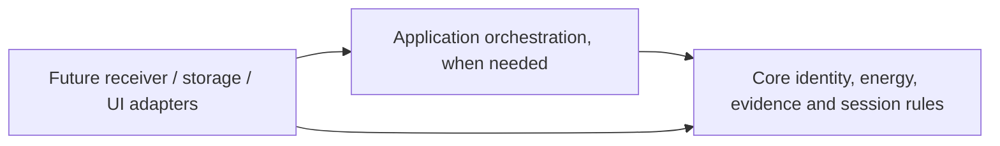

# Code and architecture design for coding agents

This is contributor guidance for future changes, adapted from the user-supplied
*Guide to Writing Clean, Maintainable Code and Architectural Design*
(`deep-research-report.md`, supplied 2026-10-02). It is not an implementation
approval or a new product specification. Read it with [AGENTS.md](../AGENTS.md),
[security](../SECURITY.md), the approved OpenSpec change, and the actual code/tests.
The guidance is self-contained. External source names are attribution, not
instructions to leave the repository or start additional work.

## 1. Establish scope before designing

- Trace each behavior change to an approved requirement and observable scenario.
  Start with a proposal for new behavior; implementation needs explicit approval.
- Inspect the existing public API, callers, tests and relevant `.agents/skills`
  before selecting a design. Do not infer the current implementation from older
  planning text. Retained OpenSpec history and [architecture](architecture.md)
  describe some components that do not exist.
- State what is implemented, what is only proposed, and what this change excludes.
  A design guide does not authorize a refactor, dependency, live integration,
  deployment, data collection, spending or broader functionality.
- Keep a behavior-preserving restructuring separate from feature changes when
  practical. Explain any public API or dependency change before implementing it
  within the approved workflow. Do not silently expand scope to clean up neighbors.
- If this guidance conflicts with the approved contract or another mandatory
  requirement, surface the conflict and ask for a decision rather than guessing.

Today's implemented boundary is the synthetic, in-memory offline Rust ledger,
exact offline pricing and a separate localhost demo API/frontend.
[Its domain contract](architecture.md#implemented-offline-ledger) and
[acceptance suite](../crates/chargeshare-core/tests/offline_spec1.rs) define current
behavior. See [pricing](pricing.md) and [local preview](local-preview.md) for the
additive contracts. Receiver integration, persistence, authentication, real
utility calendars, statements and a production UI remain future work.

## 2. Make the code express its intent without comments

**Do not add comments to authored code.** This includes inline/block comments,
Rust `///` and `//!` documentation comments, tests and handwritten tooling code.
Use self-documenting code instead:

- Use domain names such as `eligible_shared_charger`, `CounterRollback` and
  `OutsideVehicleScope`; avoid vague `data`, `manager`, `helper` or `process`
  names when a more precise responsibility is available.
- Encode units, scope, validated values and failure states in types and enums.
  Prefer `Energy` and `VehicleId` to interchangeable numbers and strings.
- Make functions cohesive, with explicit inputs, outputs and effects. Extract a
  named operation when it reveals a meaningful domain step, not merely to shorten
  a file. Guard clauses and ordinary control flow usually beat clever expressions.
- Use Rust conventions and the repository formatter. Composition, enums and
  pattern matching generally fit this core better than translated Java class
  hierarchies or a framework-shaped design.
- Give tests behavior-oriented names and clear synthetic fixtures. An assertion
  should show the expected invariant or failure, not hide it behind broad helpers.
- Put rationale, public API usage/contracts, algorithm explanations and trade-offs
  in repository Markdown or the approved change's design, linked from relevant
  docs. Keep that documentation aligned with code and tests.

Previously authored comments outside the refactored implementation are retained;
future approved code changes must follow the rule above. If a required license
notice, generated file convention, safety obligation or tool requirement requires
a code comment, preserve the required content and ask how to resolve the conflict;
do not silently remove it or invent an exception.

## 3. Keep a small facade and cohesive domain modules

`lib.rs` is the crate's public facade, not the permanent home of every feature.
Prefer private `mod` declarations and explicit `pub use` exports there. Keep
implementation in modules named for responsibilities. Expose only what callers
need; default to private items, and use `pub(crate)` only for necessary internal
collaboration. Avoid publishing all modules or wildcard re-exports by default.
Rust's module and privacy rules support these boundaries: child modules can use
private items in their ancestors; callers outside a module need explicitly public
items, and `pub(crate)` limits visibility to the current crate.

### Implemented offline core module layout

The user-approved behavior-preserving refactor on 2026-10-02 applies the
following split under `crates/chargeshare-core/src/`. This is the current file
tree at that refactor; the later pricing modules are listed below. See the
[architecture decision](architecture.md#core-module-ownership) for its contract
and trade-off.

| File under `src/` | Responsibility and existing items |
| --- | --- |
| `lib.rs` | Private module declarations and selected root public re-exports |
| `energy.rs` | `Energy`, `CounterProblem`, exact parsing, formatting and checked arithmetic |
| `identity.rs` | Validated `OwnerId`, `VehicleId`, `ConnectionId` and compound `SessionId` |
| `event.rs` | Synthetic `Event`, `EventKind`, `ChargeType` and `CounterReading` |
| `session.rs` | `Session`, quality/exclusion reasons, charger classification, evidence label and pure connection reconstruction |
| `ledger.rs` | `Ledger`, scoped registration/ingestion/reviews/reads, `Summary` and `SessionReasons` |
| `error.rs` | Safe `LedgerError` variants and error formatting |
| `money.rs` | Exact USD rate/cost types and final subtotal rounding |
| `tariff.rs` | Validated immutable synthetic rate windows and schedules |
| `pricing.rs` | Eligible interval pricing, quote lines and explicit whole-session holds |

The crate-root API remains available to callers, including integration tests
that import `chargeshare_core::*`. `Energy` retains its private representation;
its crate-private checked delta operation is the only extra arithmetic boundary
needed by reconstruction. Validation and safe diagnostics are unchanged. Keep
these properties during later approved changes.

Implemented internal dependencies are acyclic: identity uses error; event uses
identity/energy; session uses identity/event/energy/error; ledger uses those
domain modules and error. Energy/error do not depend on ledger or infrastructure.
If this split creates a cycle, reconsider ownership rather than routing imports
through the facade to hide it. If reconstruction later becomes independently
complex, a private `session/replay.rs` can hold it; do not add that extra split
without a concrete need. Small related definitions can stay together.

File length is a prompt to inspect cohesion, not an automatic failure. Neither
one-file-per-type nor arbitrary line-count limits define good boundaries. Ask
whether the parts change for different reasons, expose unrelated concepts, or
force callers to understand details they should not need.

## 4. Use onion dependencies without ceremonial layers

The lasting rule is that domain policy stays inward and technical details stay
outward. This follows the dependency rule: imports point toward domain policy,
never from domain policy toward infrastructure. A module or crate
is a boundary only if imports and public contracts enforce it.



Arrows mean **source-code dependencies**, not runtime data flow. The domain never
imports an adapter, SQL row, HTTP framework, Tesla payload type or UI component.
Adapters translate external representations into validated domain values and
translate results outward. Runtime outputs may flow outward while imports still
point inward. The diagram is a dependency policy, not an approved module tree.

For the current milestone, the existing in-memory `Ledger` can orchestrate pure
domain operations inside the core crate. Do not create an application crate,
empty adapters, repository interfaces, async runtime or service hierarchy merely
to imitate a diagram. Add a boundary when a reviewed use case needs it.

For a separately approved integration:

- Keep Tesla's official Go receiver external, as described in the proposed
  architecture. Keep its transport/payload decoding in an outer Rust adapter.
- Keep database schema, transactions, migrations and persistence errors outside
  the domain. Keep domain replay and eligibility independent of SQL and IO.
- Keep HTTP/authentication, UI formatting and exports outside core policy.
  Synthetic owner/vehicle scope checks are not production authorization.
- Inject a narrow port only when orchestration actually needs an external effect.
  Define the contract on the consuming inner side and implement it outside.
  A plain function, concrete parameter or returned result may suffice; a trait is
  justified by a real boundary or required interchangeable behavior, not a count
  of implementations. Avoid speculative generic repositories and test-only traits.
- Start with one cohesive application and modular crates/modules as needed.
  Distribution adds operational and consistency costs; a domain count alone does
  not justify microservices. The proposed external receiver process boundary
  does not require decomposing the Rust domain into services.

## 5. Choose the simplest design that preserves the contract

- **Cohesion / single responsibility:** group rules that change together; separate
  domain policy from parsing transport, storage and presentation.
- **KISS:** choose an obvious implementation. Several readable steps can be
  simpler than a dense iterator chain or abstraction-heavy pattern.
- **DRY:** share the same domain knowledge when it has the same meaning and reason
  to change. Similar-looking code with different policies may remain separate.
  Do not merge fixtures or concepts merely to reduce duplication percentages.
- **YAGNI:** implement approved behavior, not presumed future features. Improving
  a needed module boundary is compatible with YAGNI; building unused
  ports, configuration and general-purpose frameworks is not.
- **SOLID as questions:** check responsibility, substitutable behavior, small
  contracts and inward dependencies. Do not require inheritance, an interface
  for every type, or a pattern whenever existing code needs modification.
- **Measured trade-offs:** assess observed complexity, churn, performance and
  test difficulty. Metrics are investigation signals, not universal thresholds
  or automatic refactoring permission. Profile before optimizing hot paths.

ChargeShare-specific invariants take priority over generic cleanup:

- Partition by vehicle before deduplication; scope every read/review explicitly.
- Preserve stable `(vehicle, connection)` session identity and deterministic replay.
- Preserve exact checked energy arithmetic, explicit uncertainty and conflict
  barriers; never bridge a counter gap or infer a boundary from silence.
- Keep observed AC energy separate from conservative shared-charger eligibility.
  Classification cannot erase evidence-quality flags or certify physical accuracy.
- Keep rejected input out of diagnostic messages; retain synthetic-only fixtures.

## 6. Required decision and review workflow

Before a nontrivial design change, provide a short decision summary in the review
conversation or the approved planning artifact (within its authorized edit scope):

1. Approved requirement/scenario and current behavior being preserved or changed
2. Proposed responsibility/module ownership and dependency direction
3. Smallest viable approach, one relevant alternative and why it costs more or less
4. Public API/data/dependency impact and what remains deferred
5. Tests proving the invariant, failure behavior and any affected boundary

For a local helper or rename, a brief PR explanation is enough; do not create an
architecture record for every function. Capture enduring architectural choices
in the approved design or relevant repository documentation. Ask before departing
from the approved plan or broadening a behavior/API change.

Use a focused failing regression test before a bug fix where practical, then the
smallest change that passes it. Tests must exercise behavior and failure paths,
not lock in private module layout. Keep the offline acceptance suite as the public
contract during a split; add focused unit tests for meaningful local edge cases.
Do not weaken, filter, ignore or rename away existing scenarios to make CI pass.
No coverage percentage alone proves correctness.

Before publishing, review the exact diff and complete this checklist:

- [ ] Scope is approved; implemented/proposed claims and unchecked tasks are accurate.
- [ ] Module ownership is cohesive, facade exports deliberate, dependencies inward/acyclic.
- [ ] No comments were added to authored code; names/types/functions/tests express intent.
- [ ] No speculative abstraction, feature, dependency or unrelated cleanup was added.
- [ ] Identity isolation, energy/uncertainty, safe diagnostics and API compatibility hold.
- [ ] Changed behavior has readable tests, including failures and deterministic replay.
- [ ] Applicable checks below pass; blocked or unrun checks are disclosed explicitly.
- [ ] Documentation and public examples use only synthetic data and match current behavior.

Follow [security](../SECURITY.md) and [testing](testing.md) for setup and full rules:

```sh
npm run spec:validate
node scripts/security/test-guards.mjs
cargo fmt --all -- --check
cargo clippy --workspace --all-targets --locked -- -D warnings
bash scripts/testing/offline-suite.sh
git diff --cached --check
bash scripts/security/scan.sh staged
bash scripts/security/scan.sh history
```

Check remote commit and CI evidence before claiming publication or readiness.
Do not bypass hooks, mark work complete without verification, merge, archive or
deploy merely because the code passes. Those steps remain subject to their own
workflow and authorization.

## Sources and adaptation notes

The supplied report is background, not independently verified research evidence.
Its principles were made repository-specific: Rust composition/modules replace
Java inheritance examples; expressive code replaces its comment advice; cohesion
replaces rigid size/complexity/coverage thresholds; abstraction requires a real
need. The diagram above corrects the report's outward dependency arrows. None of
these recommendations requires adding new quality tooling.

Primary source attribution for this adaptation:

- Robert C. Martin, *The Clean Architecture*: inward imports
  and separation of policy from infrastructure; no mandatory number of layers.
- *The Rust Book*, *Control Scope and Privacy with Modules*: module
  organization and visibility. The ChargeShare split is our design choice.
- Martin Fowler, *Yagni*: defer speculative capability without neglecting
  maintainability or tests.

The original report also names *Clean Architecture*, PEP 8, Airbnb/Google style
guides and SonarQube, plus these tools/guides: Pylint, Black, ESLint, Prettier,
Checkstyle, SpotBugs, PMD and Google Java Style. These names preserve source
provenance; they are not a Rust dependency list, adopted policy or research task.
