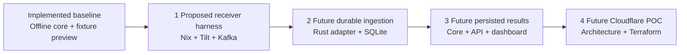

# ChargeShare proof of concept plan

Build the working synthetic POC locally in three stages, then validate and deploy
the reviewed architecture on Cloudflare using Terraform. Each stage has its own
acceptance boundary and review; this roadmap does not approve implementation,
deployment, credentials, spending or real vehicle access.

The current baseline is the implemented offline Rust ledger and exact pricing,
plus a loopback Rust API and React/shadcn fixture dashboard. Receiver transport,
Kafka integration, durable ingestion and Cloudflare hosting are not implemented.
See [architecture](architecture.md), [pricing](pricing.md) and
[local preview](local-preview.md) for existing behavior.

## Route to a working POC

Arrows show milestone order, not runtime data flow. The first three stages stay
synthetic and local on Linux x86_64 machines or suitable cloud Linux environments
with a permitted Docker daemon. The Cloudflare stage starts after the local path
works; a generic Linux test is not evidence of Cloudflare compatibility.

The eventual synthetic path is client → official receiver → Kafka → ChargeShare
Rust normalization and durable ingestion → existing ledger/pricing core → scoped
persisted API/dashboard reads. A working POC must retain correct results across
replay and restart, expose missing/conflicting evidence as holds, and preserve
the core's identity and exact-arithmetic rules. It is not a real bill or a claim
of utility-meter accuracy.

## Ownership and boundaries

| Component | Software ownership | ChargeShare responsibility |
| --- | --- | --- |
| Fleet Telemetry receiver and its Kafka dispatcher | Tesla upstream | Pin, configure and operate the official receiver; do not rewrite its transport or dispatcher. |
| Synthetic transport client | Upstream protocol/test helpers | Adapt finite fictional fixtures and validate the exchange. |
| Kafka broker | Apache Kafka | Operate and configure the broker and its handoff; no managed provider is selected. |
| SQLite | Upstream embedded database | Own schema, migrations, transactional ingestion and the database lifecycle. |
| Rust integration, domain rules, API and dashboard | ChargeShare application code with its declared dependencies | Own normalization, replay orchestration, evidence quality, exact pricing and scoped presentation. |
| Cloudflare platform and Terraform provider | Upstream infrastructure services/tooling | Design the deployment topology and versioned infrastructure configuration after compatibility review. |

Transport, storage and presentation remain outside the pure Rust domain core.
The receiver's decoded record and acknowledgment are transport evidence, not an
accepted ledger event or a durable application transaction.

## Stage 1 Receiver transport harness

**Status:** Proposed in the active
[local Nix/Tilt/Kafka change](../openspec/changes/local-nix-tilt-kafka-harness/proposal.md).
Its [design and support matrix](../openspec/changes/local-nix-tilt-kafka-harness/design.md)
and [tasks](../openspec/changes/local-nix-tilt-kafka-harness/tasks.md) own the
implementation details. The new harness and its integration CI have not run.

Provide pinned Nix tools and a Tilt-managed local Compose graph containing the
official receiver and one Kafka broker. Keep the existing API/frontend as
independently labeled fixture-demo resources. Generate isolated local-test trust
at runtime and make the smoke test explicit and finite.

**Acceptance:** A fresh Linux x86_64 checkout can start the pinned stack, become
protocol-ready, send a fictional fixture through the actual receiver's mTLS
WebSocket transport, receive the expected protocol acknowledgment and observe
matching decoded fields on the configured Kafka topic within bounded deadlines.
Acknowledgment alone, process startup and direct Kafka injection cannot pass.
Reject invalid client trust, isolate runs from stale records, and verify safe
stop/reset behavior. The proposed GitHub Actions job uses a fresh `ubuntu-24.04`
x86_64 runner, fails on setup/assertion/timeout errors and always tears down with
only allowlisted synthetic diagnostics.

**Boundary:** This proves synthetic receiver-to-Kafka transport. It does not
normalize into core events, persist a ledger, calculate telemetry-backed costs
or feed the dashboard. Existing fixture totals stay independent.

## Stage 2 Durable Rust ingestion

**Status:** Future separate OpenSpec proposal and PR, not yet created. Depends on
stage 1's verified decoded schema and delivery/acknowledgment behavior.

Define the outer Rust consumer/normalizer, configured synthetic identity mapping,
evidence retention and SQLite schema. Specify deduplication, late/conflicting
messages, transaction boundaries and durable consumer progress before building.
Keep upstream payload types and database details out of the core. Decide how
retained transport evidence reconstructs the domain's explicit session boundaries
without inventing samples or treating silence as completion.

**Acceptance:** Fixed multi-vehicle records map into valid scoped core events;
duplicates and reordered/late input replay deterministically without double
counting. Missing, invalid and conflicting readings remain visible. Demonstrate
reconnect and restart at transaction/consumer-progress boundaries, including a
crash between reading and committing, with no lost accepted evidence or inflated
energy. Review safe diagnostics and unknown-identity rejection.

**Boundary:** Durable synthetic ingestion and replay only. Production allowlists,
real telemetry retention, account authentication and vehicle provisioning need
their own reviewed contracts before any live input.

## Stage 3 Persisted charging results

**Status:** Future separate OpenSpec proposal and PR, not yet created. Depends on
stage 2's durable evidence and replay contract.

Use the existing Rust ledger/pricing core to calculate scoped sessions, eligible
energy and exact priced subtotals from persisted evidence. Replace the dashboard's
fixture-backed read path with explicit persisted API reads while retaining demo
labels for synthetic data, review/classification boundaries and visible holds.
Version rates and preserve calculation provenance; do not make the frontend
responsible for money arithmetic.

**Acceptance:** The full local synthetic path produces the expected per-vehicle
sessions and core-calculated results in the dashboard. Replaying or restarting
does not change complete results or count them twice. Missing readings, absent
rates and conflicts display incomplete/held results rather than invented zeroes.
Scope checks reject reads/reviews outside the configured owner/vehicle boundary.
The integration test now includes ingestion, persistence and API results rather
than using stage 1's Kafka success as proof of the whole application.

**Boundary:** A working local synthetic POC. Real utility calendars, bills,
payments, production authentication and cross-owner sharing are not implied.
Domain scope checks alone are not authentication.

## Stage 4 Cloudflare architecture and Terraform deployment

**Status:** Final future stage after the three local stages work. Requires a
separate architecture/security proposal and deployment PR; neither exists yet.

Choose the actual Cloudflare runtime and topology before writing deployment
code. Validate the official receiver, Rust processes, broker placement and storage
against that runtime rather than assuming Cloudflare supplies an ordinary Docker
host. Resolve these decisions first:

- Image/CPU architecture, process lifecycle, resource limits and cold-start behavior
- Receiver WebSocket/mTLS ingress and preservation of authenticated client-certificate identity
- Private receiver-to-broker and broker-to-consumer connectivity and access control
- Durable evidence, consumer progress and SQLite/storage recovery across restarts;
  do not assume a local container disk is durable
- Private authenticated API/dashboard access, identity scope, secret handling,
  observability, retention, cost limits and rollback

Use Terraform for the reviewed Cloudflare infrastructure, with pinned Terraform
and provider versions and a reviewed plan before apply. Verify that the selected
resources are supported by the provider; document any required application/image
deployment steps separately instead of claiming Terraform covers everything.
Protect Terraform state and credentials, and keep them out of this public repo.

**Acceptance:** After explicit deployment authorization, provision the agreed
synthetic POC, exercise its actual Cloudflare ingress and complete persisted path,
and verify acknowledgment, correct scoped results, rejection behavior and
restart/recovery under the platform lifecycle. Validate the Terraform plan,
repeatable configuration, safe rollback and resource/cost boundaries. Linux CI
continues to protect local behavior; a separate Cloudflare run proves deployment
compatibility. Resolve unsupported ingress or persistence before declaring this
stage complete.

**Boundary:** A synthetic Cloudflare POC on a reviewed architecture. Live Tesla
registration, OAuth, key pairing, real data and accuracy/reimbursement validation
remain separately authorized work. No cloud resource or credential is created
by this plan.

## Review and evidence

Keep stage 1's active change separate from the future ingestion, persisted-results
and Cloudflare changes. Add their spec/PR links here when they are created; do not
mark stages implemented based on this roadmap. For each implementation, record
the exact commit, pinned inputs, acceptance results and known unsupported cases.
After review, implementation and verification, sync accepted requirements and
archive that change on its PR before any separately authorized merge.

The ownership and local-stage boundaries follow the existing architecture guide.
Official Tesla Fleet Telemetry, GitHub runner/image, Tilt CI, Cloudflare Containers
architecture and Cloudflare Terraform provider documentation informed this plan.
Those references establish tooling/platform guidance, not an executed integration
or a preselected Cloudflare deployment architecture.
