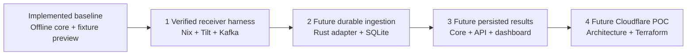

# ChargeShare proof of concept plan

Build three synthetic local stages, then validate Cloudflare using Terraform.
Each needs reviewed acceptance; this roadmap authorizes no implementation,
deployment, credentials, spending or vehicle access.

Offline ledger/pricing, fixture preview and stage 1's synthetic receiver/Kafka
harness are implemented and verified. Stages 2–4 need separate changes.

Current planning follows the [Wayfinder map](https://github.com/jestrada/ChargeShare/issues/9).
The [durable ingestion acceptance issue](https://github.com/jestrada/ChargeShare/issues/12)
tracks the remaining work in the existing ingestion PR. OpenSpec is paused;
linked artifacts below remain reference material. Track current scope, tasks and
acceptance evidence in GitHub Issues and PRs through `gh`.

## Route to a working POC

Arrows show milestone order. Local stages target Linux x86_64 with permitted
Docker, including private cloud hosts. Cloudflare follows working local stages;
Linux success establishes no Cloudflare compatibility.

Keep scoped, exact results across replay/restart; show missing/conflicting
evidence as holds. Synthetic results establish no real bill or meter accuracy.

## Ownership

| Component | Owner / ChargeShare responsibility |
| --- | --- |
| Official receiver / dispatcher | Tesla; pin and configure, preserve upstream transport. |
| Synthetic client | Upstream helpers; adapt finite fictional fixtures. |
| Kafka | Apache; configure retained handoff, no managed provider selected. |
| SQLite | Upstream; own schema, migrations, transactions and lifecycle. |
| Rust integration / core / API / dashboard | ChargeShare; normalize, replay, price and present scoped evidence. |
| Cloudflare / Terraform provider | Upstream; review topology and versioned infrastructure. |

Transport, storage and presentation stay outside the pure Rust core. Receiver
ACK and decoded records do not establish an accepted ledger event or database
commit. Existing behavior is documented in [architecture](architecture.md),
[pricing](pricing.md) and [local preview](local-preview.md).

## Stage 1 Receiver transport harness

Completed and archived on 2026-10-10: [proposal](../openspec/changes/archive/2026-10-10-local-nix-tilt-kafka-harness/proposal.md),
[design](../openspec/changes/archive/2026-10-10-local-nix-tilt-kafka-harness/design.md),
[tasks and evidence](../openspec/changes/archive/2026-10-10-local-nix-tilt-kafka-harness/tasks.md).
Canonical contracts are [local development](../openspec/specs/local-development/spec.md)
and [synthetic telemetry harness](../openspec/specs/synthetic-telemetry-harness/spec.md).
[Testing](testing.md) records complete fresh Linux acceptance, failure proof,
retained restart/reset and cache timings.

Pinned Nix/Tilt/Compose manages receiver, Kafka and separate fixture preview.
**Acceptance:** Fresh Linux protocol readiness, finite mTLS WebSocket exchange,
ACK **and** matching decoded Kafka fields within deadlines. Reject invalid
trust/stale matches; verify stop/reset. The fresh `ubuntu-24.04` gate fails
setup/assertions/timeouts, cleans up and retains safe diagnostics. ACK-only/direct
injection cannot pass. Ingestion, persistence and telemetry-backed results remain
outside stage 1.

## Stage 2 Durable Rust ingestion

After verified schema/delivery, propose ingestion separately.
Define the outer consumer/normalizer, synthetic identity mapping, retained evidence,
SQLite migrations, deduplication and atomic transaction/consumer-progress contract.
Keep payload/database types outside the core. Define how retained evidence
reconstructs session boundaries without invented samples or completion from silence.

**Acceptance:** Scoped multi-vehicle mapping, deterministic duplicate/reordered/late
replay, visible missing/invalid/conflicting readings, safe diagnostics and
unknown-identity rejection. Exercise reconnect/restart and crashes between reading and committing,
without lost accepted evidence or inflated energy. Production allowlists, real
retention, authentication and provisioning need separate contracts.

## Stage 3 Persisted charging results

After durable ingestion, propose persisted API/dashboard reads using existing
core session, eligibility and pricing rules. Retain synthetic labels, review boundaries, visible holds, versioned rates and calculation
provenance; money arithmetic stays in Rust.

**Acceptance:** Expected per-vehicle sessions/results across the complete path;
stable replay/restart without double counting. Missing readings/rates and conflicts
show held/incomplete results, never invented zeroes. Reject out-of-scope reads and
reviews. Test persistence/API results rather than treating Kafka success as whole-app
proof. Real utility calendars, bills, payments, production authentication and cross-owner sharing stay
outside this local POC; scope checks alone are not authentication.

## Stage 4 Cloudflare architecture and Terraform deployment

After local success, propose architecture/security and deployment separately.
Validate the actual runtime first:

- Image/CPU support, lifecycle, resource limits and cold starts
- WebSocket/mTLS ingress preserving authenticated client-certificate identity
- Private broker/consumer connectivity and access control
- Durable evidence, offsets and SQLite/storage recovery; local disk is not assumed durable
- Private authenticated UI/API, scope, secrets, observability, retention, costs and rollback

Pin Terraform/provider versions and review the plan before apply. Verify provider
resource support; document application/image deployment separately. Keep protected
state and credentials outside this public repository.

**Acceptance:** After explicit deployment authorization, exercise actual Cloudflare
ingress and the complete persisted path: ACK, correct scoped results, rejection
and platform restart/recovery. Verify repeatable Terraform configuration, safe
rollback and agreed resource/cost limits. Resolve unsupported ingress/storage
before completion. This remains synthetic; live Tesla setup and accuracy or
reimbursement validation need separate authorization.

## Review and evidence

Link issues and PRs; record exact commits, pins, acceptance and unsupported
cases. Review and verify the approved acceptance before an authorized merge. Official upstream
guidance establishes no executed compatibility or chosen Cloudflare topology.
