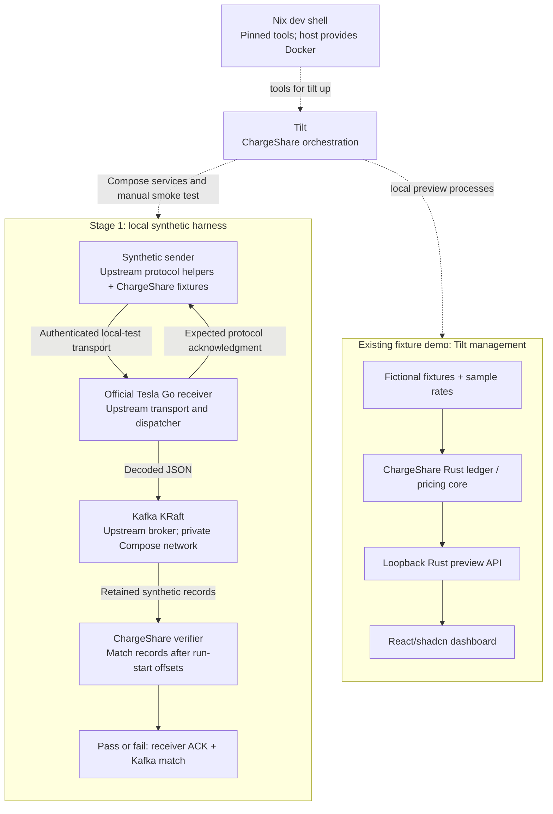

# Design

## Outcome at a glance

Pinned Nix and Tilt/Compose provide Linux x86_64 receiver-to-Kafka testing.
Full transport and lifecycle acceptance passed on fresh Ubuntu 24.04 x86_64
on 2026-10-10. The fixture dashboard stays independent.

Solid arrows show data; dotted arrows show lifecycle. Tesla owns the receiver; Kafka owns the broker;
ChargeShare owns fixtures, verification and orchestration. Clients trust only the
test CA; the unpatched receiver retains its upstream built-in CA behavior.

## Context and scope

See [proposal](proposal.md) for motivation, [tasks](tasks.md) for evidence,
[local-development](specs/local-development/spec.md) and
[harness](specs/synthetic-telemetry-harness/spec.md) specs for acceptance, and
[setup](../../../../docs/local-development.md) for versions, commands and deadlines.

**Goal:** One inspectable, bounded synthetic transport test alongside the fixture
preview, with explicit stop/reset and unchanged inward Rust dependencies.

**Excluded:** Rust ingestion, SQLite, receiver-backed dashboard results, live
Tesla setup, public ingress and production/utility-meter guarantees. Later work
belongs to the [POC roadmap](../../../../docs/plan.md).

| Surface | Verification boundary |
| --- | --- |
| Offline core / fixture preview | Existing checks pass; no receiver/Kafka coverage. |
| Local harness | Linux x86_64 with permitted Docker; complete transport/lifecycle scenarios verified on GitHub's host daemon. |
| Hosted integration | Fresh `ubuntu-24.04` x86_64; failure proof followed by exact-commit full acceptance. |
| Other platforms / Cloudflare | Deferred; Linux success establishes neither. |

## Decisions

### 1. Nix supplies tools; the host supplies Docker

Pin the flake, tools and services. Match `rust-toolchain.toml` through pinned
inputs or overlays. Cargo and npm locks remain authoritative. Print tool versions, receiver revision and
image digests.

Hosts need Nix flakes and `nix-command`, a running Linux-container daemon,
permission to use it and first-fetch network access. Cloud Linux hosts need the
same runtime, private networking and loopback listeners. Nix does not install
Docker, change socket permissions, provision infrastructure or accept agreements.
Record tested architecture/runtime; defer other platforms.

Shell entry starts nothing. `tilt up` runs visible preflight and locked
build/install prerequisites, including frontend dependencies. Surface cold-cache
failures; never upgrade locks or download unpinned scripts silently.

Host installs drift; Nix services add lifecycle complexity; Kubernetes adds a cluster.

### 2. Tilt manages a small Compose graph

Run one digest-pinned Kafka KRaft broker and revision-pinned official receiver.
Derive stable project/network/volume names from the checkout. Avoid all-dispatcher
stacks, mutable tags and extra brokers.

Receiver/verifier access Kafka privately. Publish a correctly advertised loopback
broker listener only if host inspection requires it. Receiver transport, Tilt and
preview host listeners stay loopback; profiler/debug endpoints stay unpublished.
Container listeners may bind within the private network.

Manage API and Vite independently, with ordered locked builds, logs, readiness
and child-process cleanup. Retain direct preview and fixture-demo labels.

Readiness uses Kafka metadata, the selected receiver's supported status endpoint
and an authenticated synthetic handshake, with bounded deadlines and explicit
resource dependencies. TCP/process startup cannot pass transport acceptance.
Inspect pinned-version behavior before selecting probes; document final log/status
commands and resource names.

Tilt 0.37.7 marks Compose resources ready when their processes run, including
while Docker health is still starting. Cold compilation masked this race. Add
an explicit `broker-ready` local prerequisite that waits up to 180 seconds for
the owned Kafka protocol healthcheck before starting receiver. The final
`receiver-ready` probe likewise waits for authenticated receiver health before
its metadata/topic/status checks. Failed/exited owned containers fail promptly;
missing/starting interfaces remain pending only until their bound. Keep the
existing manual ACK-plus-record acceptance separate from readiness.

Containers reduce host coupling; omit second orchestrators and observability stacks.

### 3. Kafka provides the retained handoff

Kafka supports the official dispatcher, retained records and independent readers.
Redis Pub/Sub cannot replay; Streams needs a different dispatcher API. Avoid a
custom handoff.

Configure decoded JSON and only required telemetry/connectivity records. Verify
the pinned receiver's acknowledgment policy. Receiver ACK, broker retention and
future atomic database/offset commit are separate guarantees. Single-broker
synthetic tests establish neither production durability nor exactly-once delivery.

### 4. Exercise the official authenticated transport

Use pinned, reviewed upstream protocol/test helpers with license notices. Keep
the ChargeShare Rust driver outside the core; Go tooling remains external.

Generate disposable CA/client/server certificates in ignored runtime storage,
with restricted permissions and read-only mounts where possible. Exclude keys
from Git, Nix store inputs, image layers and reports. Never change OS/browser
trust or weaken TLS. Clients trust only the test CA. As approved on 2026-10-04,
the unpatched receiver retains its default production root (or selected upstream
engineering root) and additionally trusts the test CA. Reject unrelated generated
CAs. Configuration remains synthetic-only; this grants no external account access
or real-vehicle enrollment.

Trigger finite, manual `telemetry-smoke` through Tilt's UI/CLI. Use fictional
identities, fixed times and complete/missing/duplicate/out-of-order fixtures.
Record the pinned revision's decoded schema and duplicate behavior.

Capture per-partition start offsets before sending. Use supported run markers and
an isolated consumer position, or exclusive execution when markers cannot survive
transport. Compare only records after that boundary. Normalize documented volatile
envelope fields, preserving identity, source times, validity and values. Compare
per-vehicle semantic multisets or defined partition order, never global arrival
order. Negative checks use the same isolation and observation deadlines.

Success requires the expected receiver ACK **and** matching decoded Kafka output.
Direct broker injection cannot replace this test. Missing readings stay missing;
transport results establish no ledger deduplication or reimbursement calculation.

### 5. Stop retains state; reset requires confirmation

`tilt down` stops this checkout's containers and host processes and releases
listeners while preserving its named broker volume. Closing the UI or exiting
`tilt up` alone does not stop Compose services. Certificate preparation is
startup-only: `tilt down` keeps configuration/ownership validation but must work
when test certificates are expired or incomplete. Renewing trust requires the
existing stopped-project reset, so shutdown cannot depend on valid trust.

Reset refuses active services, prints exact scope and requires confirmation.
Remove only the project broker volume, offsets and runtime files; regenerate
certificates. Never prune Docker globally or touch source, other checkouts or browser state. Two clean
reset/start/test runs must match; ordinary stop/start retains records.

### 6. Gate transport on fresh Linux runners

Run on every push/PR: fresh `ubuntu-24.04` x86_64, host Docker, no Docker-in-Docker.
Pin Nix setup; reuse local Tilt and Compose inputs, receiver revision, image
digests and expectations.

The noninteractive entry explicitly runs finite `telemetry-smoke`. Bound job,
startup and observation time; require authenticated mTLS WebSocket delivery,
expected ACK and matching topic identity/source fields/values. Setup, readiness,
assertion and timeout failures exit nonzero.

Generate test trust at runtime without Tesla accounts, real data or repository
secrets. Retain only allowlisted synthetic summaries/safe logs. Always clean up
containers, host processes and temporary state, including on failure. Prove that a controlled assertion or missing output fails
the gate, then record a passing exact-commit hosted run. Coverage ends at transport.

Cloudflare runtime, image architecture, mTLS ingress identity, private broker
connectivity, lifecycle and durable recovery require the separate Terraform-stage
review in the roadmap before any authorized provisioning.

### 7. Reuse build outputs without retaining test state

The user approved dependency and image caching on 2026-10-10. Keep the Ubuntu
runner, host daemon and pinned Nix shell. Restore/save only `/nix`, keyed by the
Nix version, Linux architecture and flake/toolchain inputs, before generating
test trust. Shell version and unchanged-lock checks run on both misses and hits.

Use pinned official Docker actions, Buildx 0.38.0 and digest-pinned BuildKit
0.34.0 with GitHub cache v2. Build the same reviewed receiver Dockerfile, export
all build stages under a Dockerfile/upstream-input/context hash, and load the
image into the job's daemon. No registry publication or new credentials are
needed. Restrict the build context to the Dockerfile and ignore definition.
Disable automatic build-record uploads; use the existing artifact allowlist.

The Python runtime helpers own CI image validation and Compose rendering. They
require this job's exact image ID, Linux amd64 and labels for the reviewed input
hash and upstream revision. After validating the original resolved Compose
configuration, remove only its receiver build field for Tilt startup. Local
development keeps source builds; teardown always uses the original reviewed
configuration and never depends on a cached image or valid certificates. This
avoids Tilt's unconditional Compose build on each startup. A second Nix container
image or registry would add publishing and lifecycle work without fixing the
retained restart. Domain types, APIs and database behavior remain unchanged.

Readiness reports only resource names, allowed status/health enums, dependency
names and known failure categories. A terminal failed build exits immediately;
pending resources retain documented deadlines. Preserve raw diagnostics only in
ignored local files. Tests cover cache identity/platform rejection, unchanged
Compose boundaries, cached-mode teardown and failure/timeout diagnostic privacy.
Measure fresh-runner cache creation and a subsequent hit; keep a cache only when
its warm restore and setup are faster overall. Full acceptance remains required.

## Risks / Trade-offs

- Native dependencies / image architecture: pin inputs and verify the selected Linux runtime.
- Nix and permitted Docker prerequisites: give concise setup and actionable preflight errors.
- Single-broker loss: restrict claims to synthetic transport/retention.
- Authentication without a production allowlist: keep private synthetic configuration; review live security separately.
- Ports / stale records: enforce ownership, loopback probes and run-start offsets.

## Migration and evidence

No product/database migration. Preserve direct preview and offline workflows.
Rollback: stop Tilt and remove entry points; reset only confirmed synthetic state.
Sync and archive after review and verification.

Official Nix/Tilt/Tesla sources were inspected on 2026-10-03; GitHub runner/Tilt CI
and Cloudflare guidance on 2026-10-04. They support design choices, not executed
compatibility. Hosted [run 38080880179](https://github.com/jestrada/ChargeShare/actions/runs/38080880179)
verified the complete stage-1 contract on commit
`8455a45e937b7f9ad7359d4fcb9b1b46a111d847`; [testing](../../../../docs/testing.md)
records assertion failure proof, cache miss/hit, versions and lifecycle results.
This editing host lacks a Nix store and Docker daemon and establishes no macOS
ARM support. Final PR checks reverify the published archival commit.
