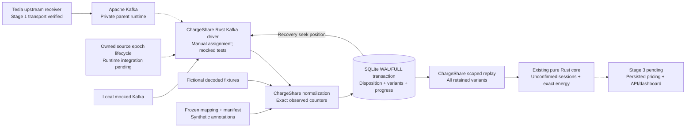

# Design

## Context

See [proposal](proposal.md) for scope. Parent [PR #5](https://github.com/jestrada/ChargeShare/pull/5) at `33a456894eefb1955a6dd28aadb997e1fc079852` publishes verified Linux receiver/Kafka transport, retained replay, restart/reset and cleanup. The approved stage-2 implementation has separate local/mocked evidence; actual receiver-backed ingestion and the owned broker epoch lifecycle remain pending.

Solid arrows show verified stage-1 transport and candidate/local/mocked ingestion
and recovery flow. Dashed arrows show pending receiver-backed ingestion/lifecycle
or deferred results, not running services.
The fixture dashboard is independent. Imports point inward: ingestion imports the core; the core imports no Kafka, SQL or receiver types. Tesla/Kafka/SQLite own upstream software; ChargeShare owns normalization, schema and transactions. Stage 1 owns transport, trust and broker lifecycle.

Inspected candidate receiver `V` output contains fictional key/`vin`, `createdAt`, typed fields and `isResend`. It lacks core connection/position/explicit boundary metadata. Six candidate records match recovered parent `ec1c892` fixtures exactly. Capture actual pinned receiver output before integration acceptance; fixture equivalence is not transport acceptance.

## Goals / Non-Goals

**Goals:** one local consumer/writer, lossless core inputs, atomic durable evidence/progress and deterministic scoped reconstruction after redelivery or process crash.

**Non-Goals:** real-world boundary inference, multi-writer/HA coordination, persistent reviews/cost projections or HTTP/UI changes. Durability covers the tested local filesystem and SQLite commit, not disk loss, backup or Cloudflare.

## Decisions

### 1. Outer Rust responsibilities

The ingestion crate has decoding, identity/manifest, SQLite, Kafka and replay modules and a small facade. Existing core API/dependencies are unchanged. Kafka/SQLite/serialization dependencies are locked; focused tests verify client controls. Avoid speculative repository/service frameworks. Follow the no-comments code rule.

Alternative: SQL/Kafka inside the core violates its offline boundary; independent microservices add consistency costs without a POC need.

### 2. Explicit synthetic associations

Freeze mapping, manifest and normalizer versions per runtime. Require unique fictional device-to-vehicle/owner mapping and equal broker key/decoded identity. Each manifest association maps configured device plus exact source time to a vehicle-wide `u64` position, connection alias, kind and charge type. Contradictory entries fail startup; different associations can deliberately share a position for conflict tests.

Validate exact UTC `createdAt`, initially integral epoch seconds; reject unsupported fractional/invalid times rather than truncate. Preserve source time and conversion version. Annotations remain distinct from observations. Only observed records create events, and counter strings come from receiver `ACChargingEnergyIn`, never expected-results tables. Complete/reconnect/silence cannot supply End.

Use `CounterReading::parse_kwh` directly: no float, rounding or interpolation. Retain valid exact decimals or safe rejection categories, not unsafe text. Missing counter stays `None`. Current core preserves the AC chain over an omitted interior sample; retain that absence without adding a new core flag. Missing boundary readings, invalid counters, rollback and conflicts keep existing behavior.

Alternative: infer connection completion from charge state. It does not prove unplugging and would change the core contract; live signals require a later reviewed contract.

### 3. Separate identity and curated evidence

Delivery identity is stream epoch/topic/partition/offset. Association is mapping/manifest version/device/source time. Domain identity is full normalized Event equality under vehicle scope. Keep every distinct variant at `(vehicle, position)`, including different connections; equal events link to one variant across deliveries. Compare canonical fields, not digest alone. Offsets, receipt time and `isResend` never assign domain identity.

Retain configured aliases, validated time/enums, valid counter or safe category, annotations/versions and delivery coordinates. Exclude names, context fields, locations and raw JSON. Unknown/malformed records retain only coordinates and fixed rejection codes. Unexpected rejection/missing evidence prevents complete-fixture acceptance.

Alternative: raw retention widens privacy risk; last-write upserts discard the conflicts the core needs to hold all implicated connections.

### 4. SQLite owns recovery progress

Use one owning process and manual topic/partition assignment, initially stage 1's single partition. Disable automatic Kafka commit/offset-store behavior; no group rebalance or broker checkpoint is recovery authority.

Process fetched records in partition order. One SQLite transaction stores disposition, curated evidence, normalized variants/links and the next safe resume position after every preceding consumed record has a durable disposition. Numeric Kafka offsets can contain non-record gaps. Confirmed rollback changes neither evidence nor progress; an interrupted commit recovers consistent old-or-new state. Restart seeks SQLite progress; forced reread is idempotent and changed semantic contents at the same delivery coordinate fail without overwrite.

Verify WAL, `synchronous=FULL`, foreign keys and bounded busy timeout. Keep the database and WAL/SHM companions on one owned ignored local filesystem. Storage failure stops consumption without advancing progress.

Kafka's [external offset storage guidance](https://kafka.apache.org/41/javadoc/org/apache/kafka/clients/consumer/KafkaConsumer.html) supports atomic results/position storage and recovery seek. SQLite's [synchronous](https://www.sqlite.org/pragma.html#pragma_synchronous) and [WAL guidance](https://www.sqlite.org/wal.html) inform local durability settings. Child-process recovery tests establish local SQLite behavior; they do not establish the actual receiver path.

Alternative: separate broker/evidence commits introduce a second recovery authority; before-write checkpointing can lose evidence. No broker-wide exactly-once claim is made.

### 5. Versioned schema and lifecycle

Schema responsibilities: runtime metadata/versions, frozen registrations, unique delivery dispositions, full normalized variants, delivery/event provenance links and per-partition next position/initial boundary. Store core `u64` positions and exact energy as canonical decimal TEXT because SQLite INTEGER is signed; signed time uses checked integers. Never use SQL REAL or unchecked casts.

Bind SQLite to the isolated broker epoch recorded by lifecycle; verify cluster/topic identifiers where supported. Reset creates a new epoch. If stage 1 lacks this binding, first add the minimal reviewed synthetic lifecycle contract. Missing/mismatched epoch, changed mapping/manifest/normalizer, newer schema or out-of-range retained offsets fail without deleting state or seeking latest. Supported migrations are transactional. Reset is explicit and ownership-scoped, never automatic corruption recovery.

Alternative: recreate SQLite or reinterpret mappings on restart loses evidence or changes ownership/identity.

### 6. Reconstruct the current domain

Register frozen aliases and ingest all retained variants through the existing scoped core. Validate caller owner/vehicle pairing. Reordered/late evidence must preserve session IDs, energy and flags. Reconstructed sessions default to Unconfirmed: independent 10/4 kWh observed totals remain zero eligible kWh. Stage 3 separately owns persistent review/result reads and pricing.

## Risks / Trade-offs

- [Unverified parent transport] → Keep candidate implementation evidence separate and gate integration acceptance on pinned decoded output, published lifecycle and actual receiver acceptance.
- [Synthetic annotations resemble measured facts] → Preserve provenance; forbid counter substitution or inferred End.
- [Rejected/missing evidence hides incompleteness] → Safe dispositions and explicit complete-fixture failure.
- [Storage/retention loss] → Fail recovery gaps, preserve state and bound guarantees to tested local recovery.
- [Unbounded state/dependencies] → Finite fixtures, record/deadline limits, pinned outer dependencies and explicit reset.

## Migration Plan

Apply was approved on 2026-10-09. Independently testable normalization, SQLite recovery, bounded mocked Kafka and replay are implemented. The [guide](../../../docs/durable-ingestion.md) records remaining parent/lifecycle/actual-receiver gates and guarantee limits. Rollback preserves the database and parent harness; deployment is excluded.

Before a separately authorized merge, complete review/implementation/verification, sync this accepted delta and archive only this change on its PR, then reverify the final commit. The active parent change remains independent; planning completeness is not implementation completion.
