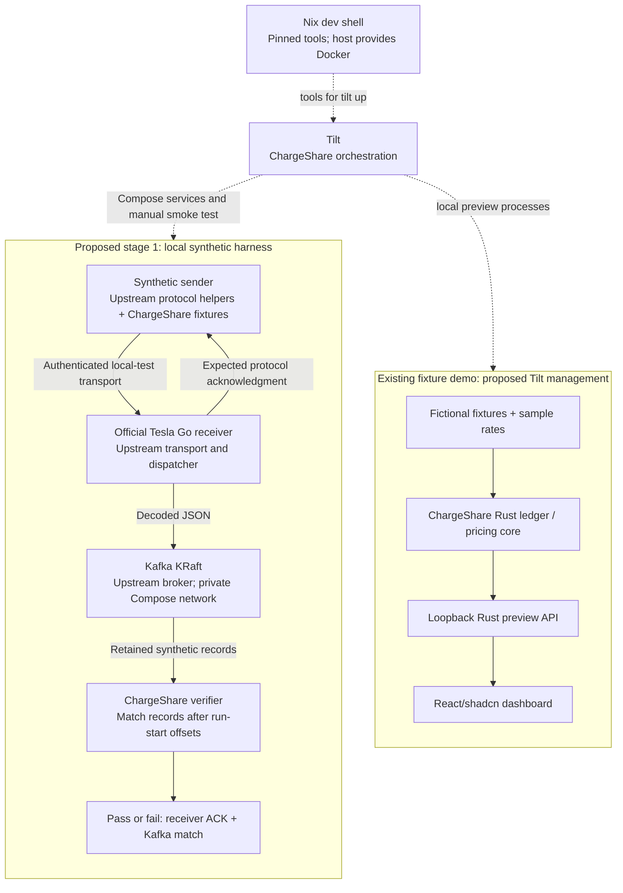

# Design

## Outcome at a glance

Proposed stage 1 runs on Linux x86_64 machines, including suitable cloud Linux
environments. Nix supplies pinned tools; Tilt manages the receiver and Kafka
through Compose, the explicit smoke test, and the existing preview processes.
The harness below is not implemented. The fixture preview already exists;
only its Tilt management is proposed.

Solid arrows show data/results; dotted arrows show tooling and lifecycle control.
Synthetic transport uses generated local-test trust only. There is no telemetry
path into the fixture demo. Rust normalization/ingestion, SQLite durability and
receiver-backed dashboard reads are deferred to separate future changes, outside
this stage's acceptance boundary. Cloud Linux execution still uses private
container networking and loopback host listeners; it does not imply deployment
or public ingress.

## Context

See [proposal](proposal.md) for motivation and scope. Main currently has the pure
Rust ledger/pricing core, a loopback Rust preview API and React/shadcn dashboard.
`scripts/preview-dev.sh` launches the two preview processes; no receiver adapter,
Kafka consumer, persistent ledger, Nix flake or Tilt environment exists.

The [local-development delta](specs/local-development/spec.md) owns the developer
experience. The [harness delta](specs/synthetic-telemetry-harness/spec.md) owns the
transport acceptance boundary. Existing product contracts are unchanged.

## Initial support and verification matrix

| Surface | Initial target | Current status / acceptance boundary |
| --- | --- | --- |
| Existing offline core and fixture preview | Existing Rust/frontend Linux checks | Implemented; these checks do not exercise a receiver or Kafka. |
| Stage 1 local harness | Linux x86_64 machine or suitable cloud Linux environment with Nix and a permitted Docker daemon | Proposed, not implemented or verified. Verify the pinned stack on the selected host/runtime before claiming support. |
| Stage 1 GitHub Actions integration | Fresh `ubuntu-24.04` x86_64 VM using its host Docker daemon and the same pinned project inputs | Proposed dedicated job; success requires a receiver acknowledgment and matching decoded Kafka output. Existing CI is not evidence that this integration passes. |
| Cloudflare deployment | Runtime, ingress and storage choices to be validated after the three local stages work | Future final plan step, outside stage 1. Passing generic Linux tests does not prove Cloudflare compatibility. |
| Other operating systems / architectures | Deferred | No initial implementation or acceptance-test requirement. |

The planning sandbox used for this amendment has no Nix, Tilt or Docker runtime,
so it has not executed the proposed stack. The first implementation verification
must use a Linux environment meeting the prerequisites above.

## Goals / Non-Goals

**Goals:** Make the first integration boundary runnable with a small local service
graph and an explicit test result. Keep host setup separate from project tools.
Expose status and logs without requiring a Kubernetes cluster. Preserve inward
Rust domain dependencies and the existing preview's synthetic behavior.

**Non-Goals:** No normalization into core events, durable consumer offsets,
transactional SQLite storage, live dashboard feed, authentication product work,
vehicle provisioning, OAuth, hosting or real-car validation. A broker record is
not an accepted ledger event or evidence of utility-meter accuracy.

## Decisions

### 1. Nix owns tools; the host owns container execution

Commit `flake.nix` and `flake.lock`. Provide the selected Tilt, Docker CLI/Compose,
Rust toolchain consistent with `rust-toolchain.toml`, Node/npm, Bash, certificate
and verification utilities from pinned inputs. Resolve any package mismatch with
a pinned overlay/input; never silently use a different Rust version. Package
lockfiles and Cargo.lock stay authoritative for project dependencies. Expose a
version summary including Nix, tools, receiver revision and image digests.

Initial support is Linux x86_64 machines, including suitable cloud Linux
environments.
Host prerequisites are Nix with `nix-command` and flakes enabled, a running
Docker daemon providing Linux containers, permission to access its socket, and
network access for the first locked dependency fetch. A cloud environment must
provide the same permitted container runtime; this change does not provision
cloud infrastructure. Nix does not install or start the host runtime, alter
socket permissions, or accept provider agreements. Record the tested Linux
architecture and host/runtime versions; do not label untested configurations
supported. Support for other operating systems is deferred.

Entering the shell does not start services. `tilt up` performs project-scoped
preflight and prerequisite build/install resources using locked inputs. The
existing npm frontend dependency install becomes a visible one-shot dependency,
so developers do not need to discover extra per-service commands. Cold-start
network/cache needs and failures remain visible. Automatic lockfile upgrades,
host package installation and silent downloads of unpinned scripts are excluded.

Alternative: independent host installs have fewer Nix concepts but drift between
machines. Nix services or a Kubernetes cluster add a second lifecycle system or
cluster setup; neither is needed for this milestone.

### 2. Tilt orchestrates a minimal Compose graph

Use Tilt's `docker_compose` integration for a single-node Kafka in KRaft mode and
the official Tesla receiver. Pin a compatible Kafka image by digest and receiver
source revision/image build inputs; do not copy the upstream all-dispatcher test
stack or its mutable tags. Use an isolated project/network/volume name derived
from the checkout, with stable names within that checkout. Kafka is a local
single-broker development system, with no production high-availability claim.

A private broker listener serves receiver and verifier containers. Publish a
separate correctly advertised loopback listener only if host inspection needs it.
Publish the receiver's synthetic transport only on loopback if needed; keep
profiler/debug endpoints unpublished. Container listeners may bind inside the
private network; host published bindings must remain loopback. Tilt itself and
all existing preview host listeners remain loopback.

Manage the existing preview API and Vite as Tilt local resources with independent
logs, readiness and process cleanup. Build/install prerequisites precede their
serve commands. Keep the existing direct preview command available. Do not wrap
it in a way that leaves child processes behind or presents the pair as one
uninspectable process. Label both as the fixture demo, separate from telemetry.

Use protocol-level Kafka metadata checks and the pinned receiver's supported
status endpoint plus a synthetic authenticated handshake. Use bounded startup
and per-test deadlines documented alongside implementation. Compose dependency
health checks and Tilt resource dependencies express ordering; a TCP connection
alone is insufficient. Inspect actual selected-version behavior before choosing
health endpoints. Tilt's UI and CLI provide per-resource status and logs;
document concrete commands with the final resource names.

Alternative: run Kafka directly as a Nix process. Containerized Kafka and the
external Go receiver reduce host-specific native library/toolchain coupling.
Kubernetes adds no needed capability here. Additional brokers and observability
stacks are deliberately omitted.

### 3. Kafka is the receiver handoff, not a backend implementation

Select Kafka for the local dispatcher because the official receiver supports it
and the proposed handoff needs retained records and independent reader positions.
Redis Pub/Sub broadcasts to currently connected subscribers without a retained
stream for later replay. Redis Streams is a different API and cannot be obtained
by merely renaming a Pub/Sub configuration. This decision avoids building a
custom dispatcher before testing the receiver boundary.

Configure the pinned receiver for decoded JSON output and only the required
telemetry/connectivity record types. Set and verify its version-specific Kafka
acknowledgment policy rather than assuming a successful client exchange proves
backend persistence. Receiver acknowledgment, Kafka retention, and a future
atomic database/offset commit are separate guarantees. No production retention
or exact-once promise follows from this local setup.

### 4. Use upstream-compatible synthetic transport, not a fake webhook

Build the official receiver and its compatible synthetic test-client primitives
from a reviewed pinned upstream revision. Reuse protocol encoding/test support
with required license attribution rather than reimplement Tesla's transport.
If a small ChargeShare-specific test driver is necessary, keep it an outer Rust
harness; official upstream Go test tooling remains an external dependency.
Never create a new Go ChargeShare backend or put Tesla types in the core.

Generate a disposable test CA and client/server certificates at runtime in an
ignored project directory. Restrict private-file permissions, mount material
read-only where possible, and never put keys in Nix expressions/store outputs,
Git, image layers or public reports. Trust applies only to the synthetic client
and receiver; do not modify OS/browser trust stores or use insecure TLS flags.
These local test credentials do not authorize persistent access to an external
account. The environment cannot select live receiver configuration.

Expose an explicit manual Tilt test resource named `telemetry-smoke`, runnable
from the UI or `tilt trigger telemetry-smoke`. Starting services does not publish
an unlimited stream. A finite fixture uses fictional `device-1`/`device-2`-style
identities, fixed event timestamps and counter/state samples. Extend with named
missing-reading, duplicate and out-of-order fixtures. Record concrete expected
receiver output for the chosen revision, including its actual duplicate behavior;
do not assume transport delivery implies domain deduplication.

The verifier records per-partition starting offsets before sending and uses an
isolated consumer group/run marker where the protocol permits. If a run marker
cannot be preserved, use exclusive harness execution and compare records strictly
after the recorded offsets. Avoid random event times. Normalize only documented
volatile envelope fields, retaining identity, source time, field validity and
values. Compare per-vehicle semantic multisets or defined partition order rather
than global arrival order. Negative tests use the same isolation and explicit
observation deadlines so old records cannot hide a failure.

A passing report requires both the pinned receiver's expected protocol
acknowledgment and matching decoded Kafka output after an authenticated synthetic
exchange. The acknowledgment alone does not prove broker delivery. A direct
Kafka fixture producer is useful for a future Rust adapter test but cannot pass
this milestone's receiver test.

### 5. Stop preserves state; reset is explicit and narrow

Document `tilt down` as the stop action. Exiting `tilt up` alone leaves Compose
services running. Verify stop behavior for host serve processes as well as
containers. Use a named project volume for retained Kafka data.

Provide a separately named reset command that refuses to run while this
checkout's services are active, prints its exact synthetic scope, and requires
an explicit confirmation flag before deletion. It removes only this project's
broker volume, test offsets and generated runtime files. It never uses global
Docker prune, deletes source, resets browser settings or touches other checkouts.
Certificates regenerate after reset. Ordinary stop/start retains state; clean
reset restores reproducible fixture expectations.

### 6. Gate the transport boundary in Linux GitHub Actions

Add a dedicated integration job on every pull request and push. Start with a
fresh `ubuntu-24.04` x86_64 VM and its host Docker daemon; do not require nested
virtualization or Docker-in-Docker. Pin the Nix setup/tooling and reuse the local
Tilt/Compose configuration, receiver revision, image digests and fixture
expectations. Use a documented non-interactive entry point that explicitly runs
`telemetry-smoke`; service readiness alone must not finish the job successfully.

Bound the entire job, startup/readiness and message-observation deadlines. Send
one finite fictional fixture through the actual receiver's local-test mTLS
WebSocket transport. Assert its expected protocol acknowledgment and the matching
decoded record on the configured Kafka topic, including fixture identity, source
fields and values. A missing acknowledgment, absent/mismatched record or timeout
fails the job with a nonzero exit. This is a minimal transport round trip; it
does not duplicate every domain-input case or include future Rust ingestion,
SQLite or receiver-backed dashboard reads.

Generate disposable test trust at runtime and use no real vehicle data, Tesla
account or repository secrets. Collect only allowlisted synthetic stage summaries
and safe logs on failure; exclude keys, certificates and unrestricted runtime
dumps. Always tear down this job's Compose resources, host processes and temporary
state, even after a failed setup or test. Prove the failure gate with a controlled
failed assertion or missing expected output, then record a passing exact-commit
hosted run before calling the implementation verified.

Cloudflare is the eventual deployment target, to be evaluated only after all
three local stages work. The future final plan step must select its actual runtime
and validate image/architecture support, receiver WebSocket/mTLS ingress and
client-certificate identity, internal broker connectivity, lifecycle limits and
durable storage/recovery. It needs a separately reviewed deployment/security plan
and explicit authorization before provisioning, credentials, spending or live
traffic. This Linux integration job makes no Cloudflare compatibility claim.

## Risks / Trade-offs

- Upstream native dependencies and container architecture support differ -> pin
  the full build closure and verify selected Linux configurations; report unsupported combinations.
- Nix bootstrap and a permitted Docker daemon remain prerequisites -> provide one concise host
  setup checklist and actionable doctor output; never claim zero-install setup.
- Single-node Kafka can lose data -> use it only for local synthetic verification;
  defer production durability and recovery contracts.
- Transport authentication is not a production vehicle allowlist -> synthetic
  trust alone is sufficient only for this isolated harness; live ingress retention
  and allowlist enforcement require a separate reviewed security contract.
- Port conflicts or stale state can create misleading results -> strict binding,
  instance ownership, protocol probes and run offset isolation.
- Exact upstream helper compatibility is not yet executed -> implementation must
  verify pinned test-client APIs and decoded schema before recording acceptance.

## Migration Plan

This is additive developer tooling with no database or product migration. Keep
existing direct preview and offline test workflows usable. Implement only after
separate approval, verify the local-development and harness scenarios, then
update setup/testing documentation. Roll back by stopping Tilt and removing the
new tooling entry points; explicitly reset only disposable synthetic state.
Do not archive this change or sync it into the canonical contract until its
implementation is reviewed and verified.

## Source Verification

Official Tilt Docker Compose guidance, Tiltfile API reference, Nix `develop` and
flake manuals, and the Tesla Fleet Telemetry README, Compose configuration,
Makefile and integration configuration were inspected on 2026-10-03. They support
the orchestration and transport approach, not an executed compatibility claim.
Official GitHub-hosted runner/image documentation and Tilt CI guidance were
inspected on 2026-10-04 for the proposed Linux integration job. Cloudflare container
architecture guidance informed the deferred runtime/ingress/storage checks; it
does not establish that this stack can be deployed there unchanged.
Version numbers, source hashes, image digests and host support evidence must be
recorded together during implementation. No Nix/Docker installation, service
startup or receiver test was performed while preparing this proposal.
