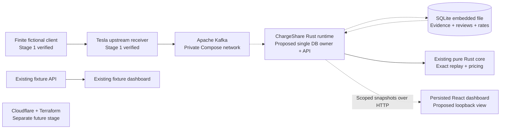

# Design

## Context

See [proposal](proposal.md). The current core prices exact scoped synthetic events. The preview rebuilds fixture data for every GET. Stage 2 has candidate normalization, local SQLite recovery and mocked Kafka tests; its replay defaults to Unconfirmed. Stage-1 transport is verified at published head `33a4568`; stage-2 source-epoch and receiver-backed ingestion acceptance remain prerequisites in its active change.

Arrows show runtime evidence/read flow, not source imports. Solid arrows identify verified stage-1 transport and existing domain/fixture boundaries; dashed arrows identify proposed or unverified integration. Upstream owns receiver, Kafka and SQLite software; ChargeShare owns adapters, schema, lifecycle, API and UI. Rust imports point inward toward the core, which imports no infrastructure. SQLite is not a separate service.

## Goals / Non-Goals

**Goals:** one discoverable complete local graph; deterministic persisted scoped results; conservative durable review/rate provenance; observable recovery and failure gates.

**Non-Goals:** multi-writer/HA services, invoices/payments, production authentication, real tariff-calendar resolution, live Tesla input or Cloudflare deployment. A loopback owner/vehicle parameter is a scope invariant, not authentication.

## Decisions

### 1. Extend the existing graph and preserve private Kafka

Run one Rust application process in Compose beside the receiver and broker. It owns ingestion, SQLite and the persisted API. Keep Kafka's existing `kafka:9092` private listener; add no broker host port. Extend strict resolved-Compose validation to allow only the named application, reviewed image/build inputs, exact project-owned application mount and IPv4-loopback API publication. Run under the runtime owner's UID/GID. Mount only `.local-runtime/application` read/write for the DB/lock/WAL/SHM; mount the owned manifest, ownership and source-epoch files individually read-only. Do not mount receiver certificates/keys into the application. Keep private directory/file/no-follow checks and verify container-visible ownership; do not relax checks for containers.

The existing `fixture-api`/`fixture-dashboard` remain 8787/5173. Proposed `persisted-runtime`/`persisted-dashboard` use 8788/5174 with host publication/listeners only on `127.0.0.1`; the latter proxies only `/api/poc` to the former. The Rust API binds its container-private interface for Compose forwarding, never a public host interface. Include all four resources plus receiver/Kafka in the all-services command and port preflight. Reuse locked dependencies, pinned Linux x86_64 tools and reviewed immutable runtime build inputs. Nix does not supply or change the host Docker daemon.

Alternative: a host consumer needs a broker host listener and a new exposure boundary. A separate API DB writer conflicts with stage 2's exclusive owner. Neither is required.

### 2. One owner, bounded requests and consistent snapshots

Add persisted mode to the outer Rust preview/application boundary using the ingestion crate. A single owning execution loop serializes bounded Kafka work, review updates and snapshot requests; any HTTP worker communicates through a narrow bounded command channel. Do not reopen `Store::open` from each API request or create a second writer. Refactor the finite consumer only as needed to share explicit polling/commit boundaries with the supervised runtime; retain its standalone bounded CLI and watchdog tests.

Each response comes from a coherent committed evidence/review/rate snapshot. Validate owner/vehicle and full `(vehicle, connection)` session identity before loading evidence or mutating reviews. Proposed reads are `GET /api/poc/owners/{owner}/vehicles/{vehicle}/results`; the bounded review operation targets that same scope/session and carries expected evidence and review revisions. No unscoped all-owner endpoint. API errors use safe fixed codes, no arbitrary input reflection. Loopback mutation additionally validates the allowed dashboard Origin/Host, rejects unexpected content types and applies body/deadline limits; local browser scope is still not authentication.

Result identity includes schema, epoch, mapping/manifest/normalizer/timestamp versions, deterministic scoped semantic evidence revision, review revision, selected immutable rate-set revision and calculation-contract version. Delivery counts/offsets may change on redelivery but do not change semantic energy/cost. Provide sanitized provenance separately. Never publish a stale cached result as current after new evidence, review or rate selection.

Alternative: persisted materialized cost tables add invalidation and transaction complexity. Reconstruct on bounded requests from retained curated evidence plus durable review/rates, returning a versioned snapshot; no invoice history is implied.

### 3. Minimal persistent manual review, with conservative invalidation

Persist classification revisions using the existing Unconfirmed/SharedCharger/OtherCharger values, scoped session key and expected semantic evidence revision. No free-text notes or real reviewer identity. Default remains Unconfirmed; acceptance first proves observed energy with zero eligible/priced energy. Explicit synthetic test-review actions then confirm only selected sessions. UI confirmation is a separate deliberate action, never implied by loading results.

Use optimistic evidence/review revision checks. Late distinct evidence makes earlier review stale; show the retained stale decision and apply Unconfirmed until explicitly reconfirmed. Duplicate semantic evidence does not stale a review. Replay an applicable decision through existing core classification; quality flags, DC/ambiguous exclusions and interval-pricing holds remain authoritative even after confirmation.

Alternative: silently reapplying every old confirmation to changed evidence is less work but hides changed review context. Automatic SharedCharger seeding would defeat stage 2's conservative default.

### 4. Immutable exact sample rates in the event time domain

Persist a bounded immutable copy/version of the existing labeled public sample tariff, exact decimal strings, effective dates, source label and explicitly pre-resolved synthetic UTC windows. Stage 2 emits integral UTC epoch seconds; the preview uses synthetic day/hour ticks. Do not pass its tick windows directly into persisted pricing. The adapter must validate the explicit fixture-clock conversion and store its version alongside window bounds. It does not implement timezone/DST or infer real utility calendars. Never shift observed timestamps or effective rate dates to obtain coverage; another dated fixture outside coverage stays held.

The complete receiver fixture currently contains 0.5/0.25 kWh, not the separate handwritten 10/4 tests. With a pre-resolved window covering its September 1 noon records at sample `0.2773931020`, confirmed scoped exact costs are `0.1386965510000000`/`0.0693482755000000` USD, rounded independently to `$0.14`/`$0.07`. Verify these against independent core reference construction. Persist provenance for source/version/window/rate/energy and core exact cost. Same-version different contents are refused; a separately selected new immutable revision reprices unchanged evidence without rewriting it. No neighboring rate fallback, interpolation, frontend multiplication or summed rounded-line totals.

Alternative: hardcoded fixture prices conceal provenance; reusing the old tick adapter misprices UTC records. A utility calendar engine exceeds this local POC.

### 5. Concrete startup and lifecycle commands

Proposed entry points, to be implemented and executed as written:

- `nix develop --no-update-lock-file -c bash scripts/dev/poc.sh up`: preflight, build/install and start every named resource through Tilt; remain supervised, print protocol/application readiness and persisted/fixture URLs, send no acceptance fixtures implicitly.
- `nix develop --no-update-lock-file -c bash scripts/dev/poc.sh check`: explicitly run the isolated finite receiver-backed acceptance and report each boundary; startup/readiness alone cannot pass it.
- `nix develop --no-update-lock-file -c bash scripts/dev/poc.sh restart`: owned state-preserving stop/start; verify existing epoch, DB, reviews/rates and scoped semantic results.
- `nix develop --no-update-lock-file -c bash scripts/dev/poc.sh down`: stop owned container/host processes and release listeners/locks while preserving broker and DB state.
- `nix develop --no-update-lock-file -c bash scripts/dev/poc.sh reset --confirm-synthetic-reset`: refuse active resources, verify exact ownership and list/deletions; reset only this checkout's synthetic broker/runtime/DB companions, then regenerate the source epoch on next startup.

Reuse stage 1 lifecycle guards; extend exact allowed resources/ports/files, not broad `prune` or recursive arbitrary deletion. Tilt exposes independent resource logs/status. Receiver status plus authenticated handshake, Kafka metadata, runtime schema/source/progress validation, scoped API and actual dashboard fetch establish readiness. Bound setup at 15 minutes, API/Tilt discovery at 90 seconds, fixture observation at 60 seconds, API requests at 10 seconds, stop at 30 seconds and the integration job at 60 minutes; timeouts fail the named boundary. Host prerequisite failures are actionable and never trigger automatic host installation or permission changes.

### 6. The last local PR proves the complete path

The dedicated fresh `ubuntu-24.04` Linux x86_64 job reuses pinned Nix/Tilt/Compose inputs and starts every resource. It records starting offsets/owned epoch before finite fictional sending, verifies receiver ACK and decoded Kafka, waits for curated DB disposition/progress, then compares scoped API and dashboard-network values to independently core-calculated expectations. Missing output, stale records, ACK-only, fixture API success or direct Kafka injection cannot pass.

Keep transport failure proof in stage 1 and ingestion acceptance in stage 2. This change verifies the added result/UI boundary plus real process crash/restart before and after commit, broker interruption, duplicate/reordered/late input, conflicts, missing boundary/rate and retention-gap refusal. Use deterministic test synchronization around actual process termination; report indeterminate commit as atomic old-or-new, never falsely claim instruction-level kill timing. Focused direct consumer tests supplement and are labeled separately.

Deliberately wrong expected result must fail the new gate; restore expectations and record a separately passing exact-commit hosted run. Preserve nonzero status through pipes, assertion/timeout failures and cleanup. Always stop only owned processes/containers and reset CI's disposable state, even on setup failure. Upload only allowlisted synthetic stage/reason/version summaries, not raw logs, DBs, payloads, certificates/keys or unrestricted runtime dumps. Manual 1280px desktop/375px mobile smoke verifies actual persisted network responses, scoped filters, explicit review/stale states, missing/held costs, line provenance, keyboard/tap behavior, no overflow and unavailable-API handling. Do not label unexecuted manual checks complete.

## Risks / Trade-offs

- [No permitted Docker/Nix runtime for this planning session] → Startup/recovery/UI acceptance remain unrun; a supported connected Linux environment or hosted CI is required for implementation verification.
- [Scope mistaken for authentication] → Loopback and explicit synthetic labels; no cross-owner combined endpoint or deployment claim.
- [SQLite/container ownership mismatch or old binary] → Verify UID/private mounts and transactional schema compatibility before consuming; preserve state on refusal.
- [Readiness or fixtures mistaken for end-to-end evidence] → Separate commands, provenance and per-boundary acceptance, with deliberate failure proof.

## Migration Plan

After a separate apply request, finish prerequisite gates in their owning changes, then add a transactional schema migration for reviews/rates/revisions without changing retained evidence/progress. Test interruption, unsupported/newer versions and migration rollback. Record the Rust-runtime/image closure and exact hosted commit. Rollback stops the new runtime and preserves DB state; older stage-2 binaries must refuse a newer schema rather than erase/downgrade it. Keep direct fixture preview usable. Update affected architecture/dependency/runtime diagrams with proposed versus verified labels in the same implementation PR. Sync/archive only this reviewed implemented verified change after acceptance; no merge or deployment is implied.
